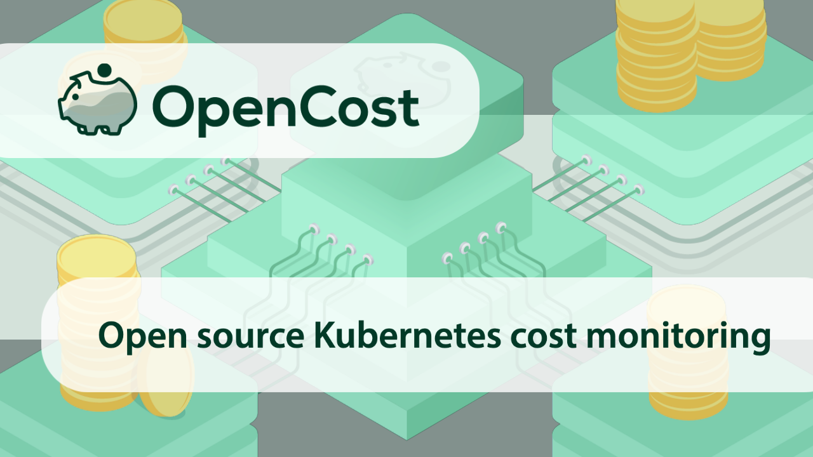

We are excited to share the launch of OpenCost, an open source project that provides real-time cost monitoring for teams running Kubernetes workloads!

<!--truncate-->

As container and Kubernetes adoption continues to grow, navigating the complexities around measuring and allocating cost is becoming a business-critical challenge. A [recent CNCF survey](https://www.cncf.io/blog/2021/06/29/finops-for-kubernetes-insufficient-or-nonexistent-kubernetes-cost-monitoring-is-causing-overspend/) showed overspend is increasingly a problem for teams scaling their Kubernetes deployments, and more than 70% of organizations do not have accurate cost monitoring in place.

Born out of the [Kubecost](https://kubecost.com) project, OpenCost introduces a new community-driven specification and accompanying implementation to solve this monitoring challenge in any Kubernetes environment above 1.8. OpenCost was developed by a group of contributing partners, including Adobe, Armory, AWS, D2iQ, Google, Kubecost, Mindcurv, New Relic, and SUSE. We feel it’s important that this project is not driven by any single entity—and that it continues to evolve and thrive within the broader Kubernetes ecosystem. Founding members of the OpenCost community are leading contributors and adopters of Kubernetes, interested in developing optimized Kubernetes experiences for their users and customers.

The contributors to the OpenCost specification have heard from our respective customers, partners, and internal teams that standardization is a pressing need for effective cost management practices across cloud platforms, Kubernetes distributions, and teams.

## Our vision for OpenCost

OpenCost seeks to develop a common standard — enabling teams using Kubernetes to operate with a single model for measuring and managing cost across all of their environments. Specifically intended for DevOps and engineering teams, OpenCost provides visibility into the black box that is Kubernetes spend.

The contributing partners collectively decided to submit the project for review as a Cloud Native Computing Foundation (CNCF) [Sandbox project](https://www.cncf.io/sandbox-projects/) because as a neutral home for cloud-native projects, we believe the CNCF is the best organization to help achieve our goals of standardizing Kubernetes cost monitoring. We are currently in the sandbox project queue, and we’re excited to continue iterating on our project based on feedback from the CNCF community. We will share updates on our progress as they develop.

Using OpenCost, you can benefit from greater visibility into current and historical Kubernetes spend and resource allocation and experience cost transparency in Kubernetes environments that support multiple applications, teams, departments and more. OpenCost aims to be platform-agnostic across all clouds, on-premises infrastructure, and air-gapped environments, and includes functionalities for:

- Real-time cost allocation by Kubernetes service, deployment, namespace, label, statefulset, daemonset, job, pod, container, and more.
- Allocation of in-cluster resources such as CPU, GPU, memory, load balancers, and persistent volumes.
- Dynamic infrastructure pricing enabled by integrations with cloud providers and on-premises pricing and/or billing APIs.
- Easy integration with Prometheus.

## Try it yourself!

Check out OpenCost on [GitHub](https://github.com/opencost/opencost) to get started in less than 3 minutes.

Let us know what you think! We love feedback and contributions, and our supportive community is here for any questions in the [#opencost](https://cloud-native.slack.com/archives/C03D56FPD4G) channel on the [CNCF Slack](https://slack.cncf.io/) community.
