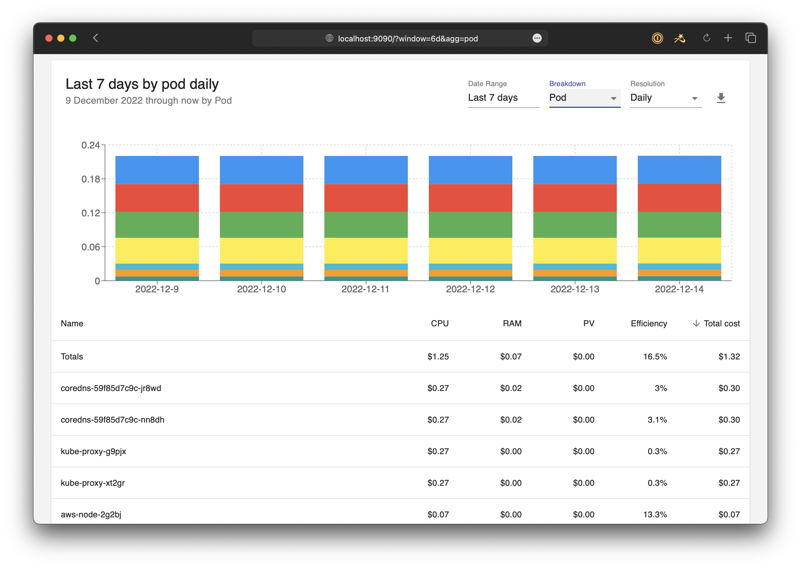

The OpenCost UI is now available as a user-friendly interface for managing Kubernetes cloud costs. It allows users to easily monitor and visualize their cloud spend, making it easier to reduce Kubernetes costs while improving efficiency.

To install the OpenCost UI you can use the container provided at (https://quay.io/repository/kubecost1/opencost-ui), which is now included in the standard [installation instructions](https://www.opencost.io/docs/install). The [opencost.yaml](https://raw.githubusercontent.com/opencost/opencost/develop/kubernetes/opencost.yaml) has been updated to deploy the container as part of the pod and listen on port 9090.

You can upgrade or install fresh with
```
kubectl apply --namespace opencost -f https://raw.githubusercontent.com/opencost/opencost/develop/kubernetes/opencost.yaml
```

Expose the UI locally on port 9090
```
$ kubectl port-forward --namespace opencost service/opencost 9003 9090
```
and you can access it on [http://localhost:9090/]

If you've been running OpenCost previously and storing your data in Prometheus, you should be able to see the UI with populated graphs like this:


Of course since OpenCost is fully open source, you can check out the [code on GitHub](https://github.com/opencost/opencost/tree/develop/ui). From there you can [build it from source](https://github.com/opencost/opencost/tree/develop/ui#readme), make your own updates, and share them back with the community.

Let us know what you think! We're here for any questions in the [#opencost](https://cloud-native.slack.com/archives/C03D56FPD4G) channel on the [CNCF Slack](https://slack.cncf.io/) community.
