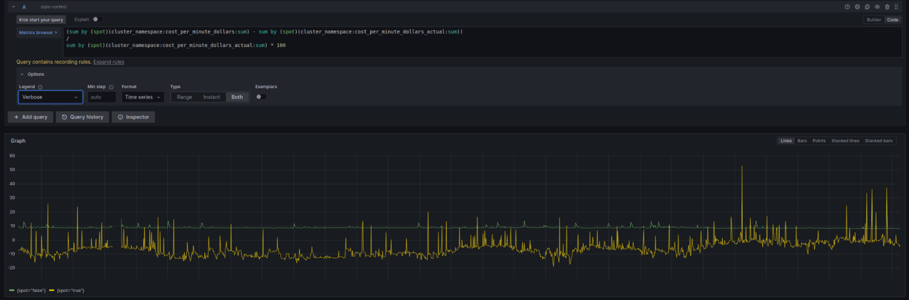
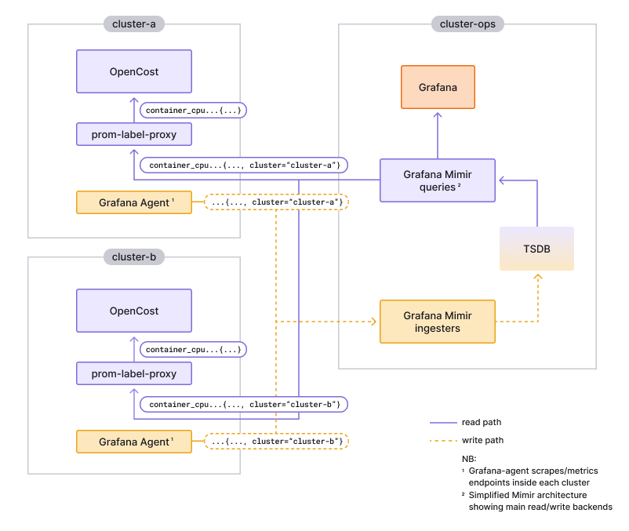

<head>
    <link rel="canonical" href="https://grafana.com/blog/2023/02/02/how-grafana-labs-uses-and-contributes-to-opencost-the-open-source-project-for-real-time-cost-monitoring-in-kubernetes/"/>
</head>
Reposted from the [Grafana Labs blog](https://grafana.com/blog/): [How Grafana Labs uses and contributes to OpenCost](https://grafana.com/blog/2023/02/02/how-grafana-labs-uses-and-contributes-to-opencost-the-open-source-project-for-real-time-cost-monitoring-in-kubernetes/)

<!--truncate-->

While more and more teams are adopting Kubernetes as their standard container orchestration technology, cost insight is lacking. Teams often don’t know how much they’re spending, where in their organization they are spending, or what is driving their infrastructure cost increases. OpenCost helps alleviate this problem by bringing real-time cost monitoring to Kubernetes workloads with a solution that encompasses both an open specification and an open source project.

[OpenCost](https://www.opencost.io/) is an [open source cost monitoring tool](https://github.com/opencost/opencost) that provides visibility into current and historical Kubernetes spend and resource allocation. Originally developed by [Kubecost](https://www.kubecost.com/) and released in 2022 as a new [CNCF sandbox project](https://www.cncf.io/projects/opencost/), OpenCost allows you to measure your infrastructure spend for your Kubernetes deployments, breaking down costs to nodes, persistent volumes, and load balancers.

"We developed OpenCost as an open source standard for the Kubernetes community to have improved cost visibility in real time," says Webb Brown, co-founder and CEO of Kubecost. "Our goal is for users to deploy and generate cost insights quickly, while also benefiting from a standardized approach to cost monitoring."

OpenCost has become an important resource for Grafana Labs in terms of understanding our Kubernetes cloud spend and improving our efficiency. This is why we recently joined the OpenCost community as a contributing partner. Since late last year, when our first commit landed in OpenCost, we have started sponsoring time for our full-time engineers to work on fixes and features for OpenCost with the goal of becoming maintainers.

"We’re so excited to see the Grafana Labs team put OpenCost to great use," says Brown, "and we look forward to furthering the project with them."

## How Grafana Labs uses OpenCost

At Grafana Labs, we have two specific use cases where OpenCost has improved our cost observability.

**1. Getting more accurate insight into vCPU and memory cost**

In the past, we had been using fixed resource list prices from cloud providers for vCPU and memory, and these costs vary greatly between providers and regions. Now we use OpenCost-provided metrics to differentiate between on-demand (“normal”) and Spot VMs, allowing for even more accurate resource cost reports. It's also worth highlighting that our cost observability improvements have been helpful for other teams. Platform engineering teams used it to improve the accuracy of Grafana dashboards, past and future trends, etc. Service engineering teams used it to improve and align their efforts to reduce our Total Cost of Ownership (TCO).

The above query shows the **error percentage between manual hardcoded CPU+memory cost vs. OpenCost's provided data** across all our production clusters, sorted by the type of VM:
* Normal VMs in green: near 10% systematic "over-calculation" if using hardcoded vs. OpenCost's
* Spot VMs in yellow: volatile from -10% to +50%

**2. Monitoring costs of a multi-cluster architecture**

We have OpenCost deployed in every cluster in Grafana Cloud, sending to a single Grafana Mimir instance. OpenCost is designed to expect its storage having the same scope as its deployment. We deployed [prom-label-proxy](https://github.com/prometheus-community/prom-label-proxy) for filtering and subsetting, showing each OpenCost instance only the data it expects to see. Leveraging Grafana Mimir this way not only avoids the overhead of running one backend per OpenCost instance' we can also query across our whole fleet.

|  |
| :--: |
| *Architecture diagram showing how each OpenCost instance does the same metrics query (i.e. without {cluster=...} label) while getting results only for the cluster where it's deployed.* |

## How Grafana Labs will contribute to the OpenCost OSS project

We identified three initial focus areas:

**1. Observability**

OpenCost has become a central part of Grafana Labs’ cost observability stack. We need to understand how our fleet of OpenCost pods is performing. As one of the leaders in the observability space, we are applying all current best practices to OpenCost. The [first change we contributed](https://github.com/opencost/opencost/pull/1577) was to expose the industry-standard [build_info metric](https://www.robustperception.io/exposing-the-software-version-to-prometheus/). The next step is to expose common operational metrics to track the health and performance of OpenCost. Based on this work, we can publish Grafana dashboards, alerting rules, and more. And yes, we plan to publish a Grafana Cloud integration based on this work.

**2. Ease of use**

As we mentioned earlier, Grafana Labs’ OpenCost deployment is not following its design assumptions; we are using one single backend for efficiency reasons. As explained above, our workaround is using prom-label-proxy. There are a few ways we would like to make it easier for others to run a similar setup:
* Make OpenCost support multi-cluster deployments.
* Open source jsonnet libraries for multi-cluster setups.
* Document how to craft queries and recording rules for multi-cluster OpenCost.

**3. Performance**

When rolling out OpenCost to all of our production clusters running Grafana Cloud we experienced a degradation below our internal Mimir read latency [SLO](https://grafana.com/blog/2022/04/18/service-level-objectives-how-slos-have-changed-the-business-of-observability/). The root cause was OpenCost’s due to queries not being step-aligned. A [query](https://grafana.com/docs/grafana/latest/panels-visualizations/query-transform-data/) is step-aligned when the start and end time is divisible by the step. Step alignment allows for more and better caching, reducing backend load. It’s one of the many techniques we build into our Grafana LGTM stack to improve software performance. We also [implemented it in OpenCost](https://github.com/opencost/opencost/pull/1473). As our usage expands and as we make OpenCost more observable, we will continue to improve its performance and resource utilization.

## Learn more and get started with OpenCost

To get started with OpenCost and cost observability, you can find the OpenCost code in [GitHub](https://github.com/opencost) and check out the [OpenCost documentation](https://www.opencost.io/docs/).

Interested in joining the OpenCost community? Get started by visiting the [OpenCost](https://opencost.io) website and get involved in the **#opencost** channel in the [CNCF Slack](https://slack.cncf.io/). You can also subscribe to the [OpenCost mailing list](https://groups.google.com/g/opencost-community), or add the [OpenCost community calendar](https://calendar.google.com/calendar/embed?src=c_c0f7q56e5eeod3j89bb320fvjg%40group.calendar.google.com&ctz=America%2FLos_Angeles) and attend the working group meetings. You’ll also find us there. :)
