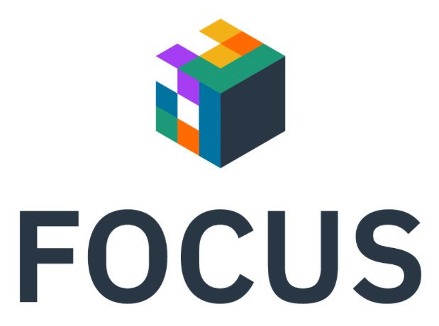

This week at the [FinOps X](https://x.finops.org) conference the FinOps Open Cost and Usage Specification (FOCUS) will be announcing the first release of their specification for defining an open standard for cloud cost, usage, and billing data. The OpenCost project is excited to announce we're supporting this standard and have already [started](https://github.com/opencost/opencost/pull/1865) [shipping](https://github.com/opencost/opencost/pull/1879) initial patches with [this terminology supported](https://github.com/opencost/opencost/issues/1921).

<!--truncate-->

The goal of FOCUS is to provide a specification for standardizing terminology and producing FinOps-serviceable billing datasets. OpenCost will continue to standardize on the FOCUS terminology in our code base and user-facing interfaces, with the goal of consuming (and potentially producing) FOCUS-based billing implementations. Recent internal [cloud provider](https://github.com/opencost/opencost/pull/1869) [code refactoring](https://github.com/opencost/opencost/pull/1902) and contributions from Kubecost have made adding additional non-Kubernetes cost monitoring to the project more straightforward and we expect FOCUS support to continue in related code.

The work's just getting started, but we're excited to align the OpenCost project with FOCUS as it continues to evolve. The first [0.5 release of the FOCUS specification](https://focus.finops.org/#specification) is now available, read over it to understand the scope of FOCUS.  If you're interested we encourage you to get involved with the OpenCost and FOCUS projects, and if you're at FinOps X stop by the Kubecost booth and ask more questions.

