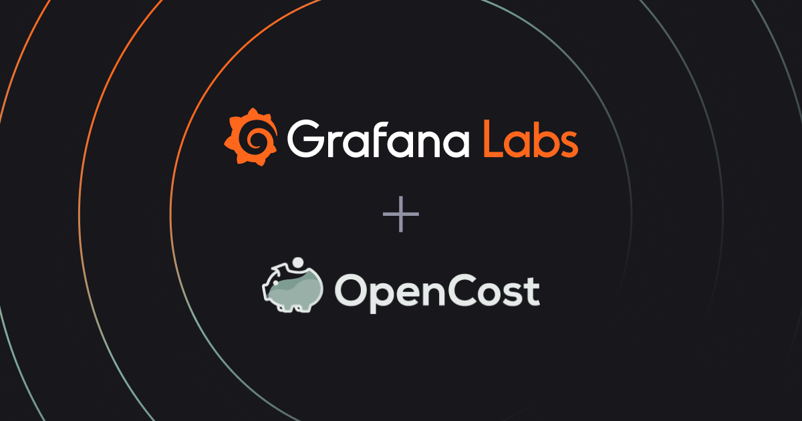

Reposted from the [Grafana Labs blog](https://grafana.com/blog/): [Rein in spending with Kubernetes cost monitoring in Grafana Cloud](https://grafana.com/blog/2023/06/26/rein-in-spending-with-kubernetes-cost-monitoring-in-grafana-cloud/)

Original authors: [Vasil Kaftandzhiev](https://grafana.com/author/vasil-kaftandzhiev/), [Jake Swiss](https://grafana.com/author/jake_swiss/)

<!--truncate-->

As your Kubernetes infrastructure — and your business — grows, so too does the headache of managing your stack. And since controlling costs is crucial for your organization’s well-being, you need visibility into your complex system to ensure you’re spending your money wisely.

That’s why we’re excited to introduce [Kubernetes cost monitoring](https://grafana.com/docs/grafana-cloud/kubernetes-monitoring/cost-monitoring/?pg=blog&plcmt=body-txt) as a new feature in Grafana Cloud. Inspired by our internal experience managing costs, Kubernetes cost monitoring measures and allocates infrastructure and container costs in real time. It also complements our recently released [resource utilization efficiency feature](https://grafana.com/blog/2023/03/03/how-to-optimize-resource-utilization-with-kubernetes-monitoring-for-grafana-cloud/?pg=blog&plcmt=body-txt), both of which are included in the [Kubernetes Monitoring](https://grafana.com/solutions/kubernetes/?pg=blog&plcmt=body-txt) solution that’s available across all tiers of Grafana Cloud.

The Kubernetes cost monitoring feature is based on [OpenCost](https://www.opencost.io/), an [open source cost monitoring tool](https://github.com/opencost/opencost) that provides visibility into current and historical Kubernetes spend and resource allocation. OpenCost has become an important resource for Grafana Labs in terms of understanding our Kubernetes cloud spend and improving our efficiency, and we recently [joined the OpenCost community](https://grafana.com/blog/2023/02/02/how-grafana-labs-uses-and-contributes-to-opencost-the-open-source-project-for-real-time-cost-monitoring-in-kubernetes/?pg=blog&plcmt=body-txt) as a contributing partner.

In this blog post, we will delve into the technical aspects of Kubernetes cost monitoring in Grafana Cloud. We’ll also explore the many benefits for site reliability engineers (SREs), Kubernetes administrators, and engineering leaders, each of whom can use the solution in different ways to gain fine-grained control over their Kubernetes costs.

## What is Kubernetes cost monitoring in Grafana Cloud?

Kubernetes cost monitoring is a feature of the Kubernetes Monitoring solution in Grafana Cloud that enables you to manage the cost of cloud resources that your Kubernetes infrastructure is consuming. In the Cost view in Kubernetes Monitoring, you’ll get visualizations that provide comprehensive insights that allow you to immediately begin to:

  * **Granular cost visibility**. Get detailed insights into costs across fleets so you can identify resource-intensive components and appropriately allocate resources, such as pods, deployments, and Persistent Volumes (PVs).
  * **Real-time cost monitoring**. Proactively detect cost-related anomalies or spikes in resource consumption with Grafana’s end-to-end Kubernetes monitoring solution.
  * **Resource scaling assessments**. Accurately predict the cost implications of scaling resources by using Kubernetes autoscaling tools, like horizontal and vertical autoscalers, to dynamically adjust resources based on demand.
  * **Faster issue resolution**. Combine cost monitoring with our resource utilization efficiency feature to identify resource bottlenecks and improve overall performance.

[A Grafana dashboard shows Kubernetes spending across AWS, Google Cloud, and Azure.](https://grafana.com/media/blog/k8s-cost-monitoring/k8s-cost-monitoring-4.png)
[A Grafana dashboard displays cluster, node, and namespace efficiency for Kubernetes.](https://grafana.com/media/blog/k8s-cost-monitoring/k8s-cost-monitoring-1.png)
## Different roles, same goals

One of the biggest advantages of our Kubernetes cost monitoring feature is its versatility. Whether you’re building and deploying applications, ensuring system reliability and performance, or managing the budget for cloud expenditures, you can put it to use and start finding savings today.
### How does Kubernetes cost monitoring in Grafana Cloud help SREs?

  * SREs can monitor and analyze the cost of individual pods within Kubernetes. By understanding the cost breakdown at the pod level, they can identify cost-intensive deployments or services and adjust their resource utilization, such as changing replica counts or right-sizing resource requests.
  * SREs can use cost monitoring as a factor in incident management. For example, if there is a sudden increase in costs accompanied by degraded performance, they can prioritize investigating and resolving the issue to prevent further cost escalation.

### How does Kubernetes cost monitoring in Grafana Cloud help Kubernetes administrators?

  * Administrators can use cluster-level cost visualizations to monitor and analyze costs at the cluster level, using CPU, memory, and storage utilization to identify cost-intensive components.
  * Kubernetes cost monitoring allows administrators to compare costs across different cloud providers or Kubernetes distributions via the cluster grouping mechanism.
  * Admins can monitor the cost of PVs used for data storage in Kubernetes. By analyzing these costs, they can identify underutilized or oversized volumes and reclaim storage resources, leading to cost savings.
  * They can also allocate costs to different namespaces based on resource usage. By monitoring costs at the namespace level, admins can identify resource-intensive namespaces, facilitate cost allocation to specific teams or projects, and encourage accountability for resource consumption.
  * Administrators can optimize cluster autoscaling. By analyzing cost data alongside cluster metrics, they can fine-tune auto scaling policies, setting thresholds based on cost considerations to ensure the cluster scales based on demand while controlling costs.

[A Grafana dashboard shows projected savings.](https://grafana.com/media/blog/k8s-cost-monitoring/k8s-cost-monitoring-3.jpg)

### How does Kubernetes cost monitoring in Grafana Cloud help engineering leaders?

  * Engineering leaders can establish cost governance practices and policies based on the curated data presented by Kubernetes cost monitoring. By using Kubernetes resource quotas and limit ranges, they can enforce compute resources and storage requests with cost-conscious decision-making.
  * By monitoring costs alongside performance metrics, engineering leaders can strike the optimal balance between performance and cost by picking the most efficient scaling strategies for their needs.

[A Grafana dashboard displays cost savings.](https://grafana.com/media/blog/k8s-cost-monitoring/k8s-cost-monitoring-2.jpg)

## Learn more about Kubernetes Monitoring in Grafana Cloud

Through continuous monitoring and optimization, you can eliminate unnecessary spending, improve cost efficiency, and maximize return on investment. With Kubernetes cost monitoring, you can take control of your budget and implement [proactive alerting mechanisms](https://grafana.com/blog/2023/03/17/how-to-migrate-existing-grafana-dashboards-and-alerts-into-kubernetes-monitoring-in-grafana-cloud/?pg=blog&plcmt=body-txt#migrating-existing-kubernetes-alerts-to-grafana-cloud) to make data-driven decisions about resource allocation, scaling strategies, and technology investments.

And by unifying your existing dashboards within Grafana Cloud, you’re ultimately building a Kubernetes ecosystem that is personalized to your needs and more powerful because of the added out-of-the-box features that our Kubernetes Monitoring solution has to offer.
