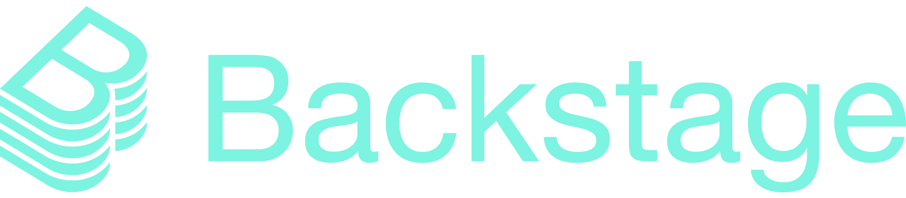
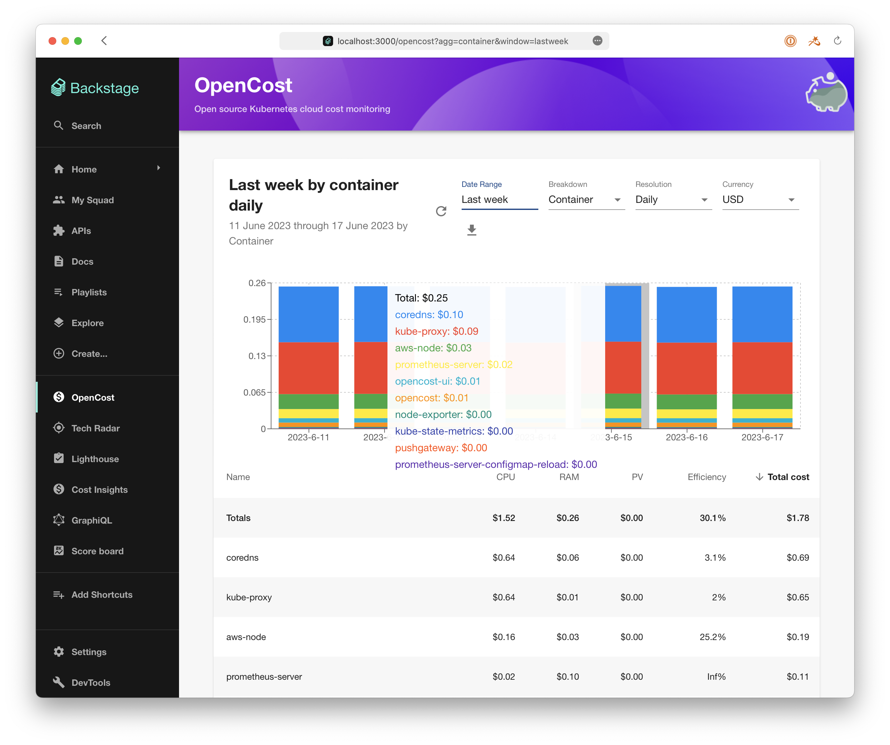

We're excited to announce that the OpenCost plugin for [Backstage](https://backstage.io) has been merged and Backstage users will soon have access to their OpenCost data in their developer portals.

<!--truncate-->

If you are unfamiliar with Backstage it is a platform for building developer portals. Like OpenCost, it's a [CNCF project](https://www.cncf.io/projects/backstage/) that is open source and freely available to use however you need. We wanted to ensure that your cloud cost monitoring data would be in your centralized developer platform so users can see the cost of their Kubernetes-based applications.

The initial release of the OpenCost plugin is an updated version of the OpenCost UI. Backstage plugins are generally written in [TypeScript](https://www.typescriptlang.org/), which required updating our UI code and cleaning up the codebase for potential issues (these changes will be ported back to OpenCost). The plugin README covers installation and configuration, today it's a dashboard for viewing your existing OpenCost deployments.

We're eager for user feedback on the plugin and suggestions for additional features. Backstage is being deployed in many different environments, please let us know what you'd like to see next from the OpenCost plugin.
