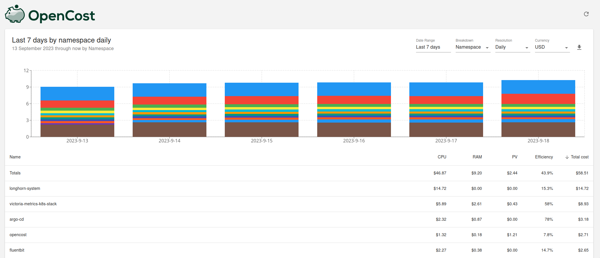
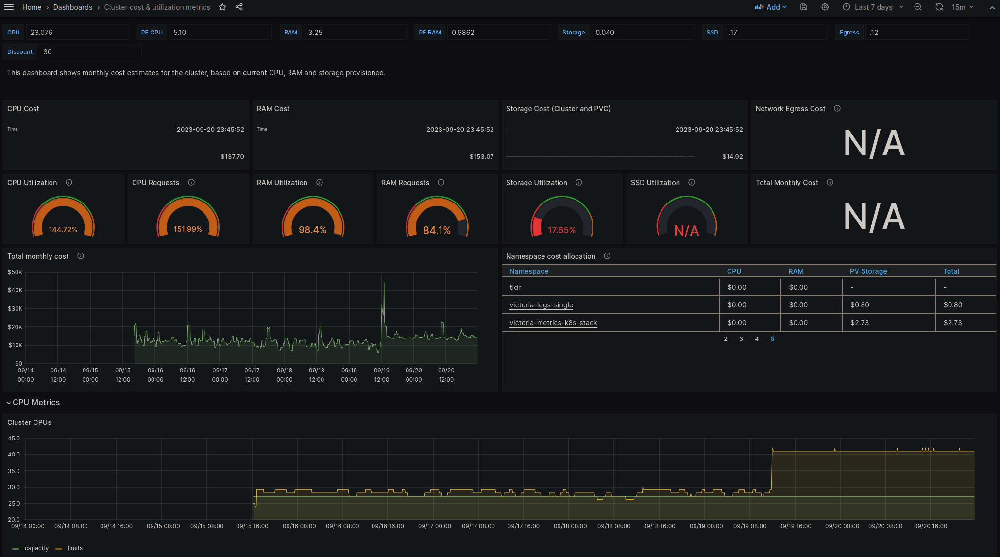

<head>
    <link rel="canonical" href="https://victoriametrics.com/blog/monitoring-kubernetes-costs-with-opencost-and-victoriametrics/" />
</head>

Reposted from the [VictoriaMetrics blog](https://victoriametrics.com/blog/): [Monitoring Kubernetes costs with OpenCost and VictoriaMetrics](https://victoriametrics.com/blog/monitoring-kubernetes-costs-with-opencost-and-victoriametrics/)

Original author: [Zakhar Bessarab](https://github.com/zekker6)

<!--truncate-->

> This article is based on a feature which wasn't merged into the main branch of OpenCost yet. Please, see [this PR](https://github.com/opencost/opencost/pull/1861)
if you want to try it out. This post will be updated once this feature is released.

Control over operational costs is pivotal in Kubernetes' deployment and management. Although Kubernetes brings power and
control over your deployments, it also necessitates thorough understanding and management of costs.
[OpenCost](https://www.opencost.io/), specifically designed for Kubernetes cost monitoring, combined with
VictoriaMetrics, an efficient time series database, offers a comprehensive solution for this challenge.

This article is a step-by-step guide for setting up OpenCost and integrating it with VictoriaMetrics for Kubernetes cost
monitoring.

## What is OpenCost?

OpenCost is a CNCF project and open-source tool for monitoring Kubernetes costs. It is designed to provide a comprehensive overview of
the costs
of Kubernetes clusters across multiple cloud providers and regions, and also supports on-premises installations.

OpenCost allows you to monitor the costs of Kubernetes cluster in real-time and provides a detailed breakdown of the
costs
for each Kubernetes resource.



### How it works

OpenCost employs [node-exporter](https://github.com/prometheus/node_exporter)
and [kube-state-metrics (KSM)](https://github.com/kubernetes/kube-state-metrics) metrics for computations. KSM metrics
can either be provided directly by OpenCost or via KSM scraping.

The system includes a cost-model for cost computation based on these metrics, and a web UI is available for their
visualization.

In order to retrieve billing information OpenCost relies on cloud provider APIs. Currently, OpenCost supports AWS, GCP
and Azure.
You can find more information about supported cloud providers in
the [documentation](https://docs.kubecost.com/install-and-configure/install/cloud-integration).
It is also possible to provide billing information manually and for on-premises deployments.

You can find detailed information about OpenCost architecture in
the [documentation](https://docs.kubecost.com/architecture/architecture/).

## Integrating VictoriaMetrics with OpenCost

Example deployment of OpenCost with VictoriaMetrics will be using
the [OpenCost Helm chart](https://github.com/opencost/opencost-helm-chart)
to deploy OpenCost
and [victoria-metrics-k8s-stack](https://github.com/VictoriaMetrics/helm-charts/tree/master/charts/victoria-metrics-k8s-stack)
Helm chart to deploy VictoriaMetrics and monitoring components.

By default, OpenCost assumes that metrics are stored and queried from [Prometheus](https://prometheus.io/).
Prometheus is a popular open-source time series database (TSDB) used for storing and querying metrics.
On the other hand, VictoriaMetrics is a fast, cost-effective, and scalable monitoring solution and time series database.
It is compatible with Prometheus and can serve as a drop-in replacement.

However, the VictoriaMetrics stack provides separate components for scraping and storing metrics.
Within the VictoriaMetrics stack, [vmagent](https://docs.victoriametrics.com/vmagent.html) is utilized for scraping and forwarding metrics to the TSDB.
Therefore, it is necessary to configure OpenCost to use different URLs for query and configuration APIs.
In order to do that with the helm chart, it is necessary to adjust the following environment variables for OpenCost
components: `SCRAPE_PROMETHEUS_SERVER_ENDPOINT`.

Please, note that support for this feature is not yet merged into the main branch of OpenCost. Please, see [this PR](https://github.com/opencost/opencost/pull/1861)
if you want to try it out. This post will be updated once this feature is released.

All examples will be using `vm` namespace for deployment of VictoriaMetrics components and namespace `opencost` for
deployment of OpenCost components.
Note that URLs for VictoriaMetrics components need to be adjusted based on the namespace they are deployed in and the
Helm release name.

### Single-node VictoriaMetrics deployment

In order to deploy single-node VictoriaMetrics, it is necessary to use the following
Helm values for VictoriaMetrics k8s-stack Helm chart:

```yaml
victoria-metrics-k8s-stack:
  vmagent:
    spec:
      externalLabels:
        cluster: k3d-1
  vmsingle:
    enabled: true
```

Helm values for OpenCost components:

```yaml
opencost:
  exporter:
    extraEnv:
      SCRAPE_PROMETHEUS_SERVER_ENDPOINT: "http://vmagent-vm-victoria-metrics-k8s-stack.vm.svc:8429/prometheus"
      PROM_CLUSTER_ID_LABEL: "cluster"
  prometheus:
    external:
      enabled: true
      url: http://vmsingle-vm-victoria-metrics-k8s-stack.vm.svc:8429/prometheus
    internal:
      enabled: false
```

### VictoriaMetrics cluster deployment

In order to deploy VictoriaMetrics cluster, it is necessary to use the following
Helm values for VictoriaMetrics k8s-stack Helm chart:

```yaml
victoria-metrics-k8s-stack:
  vmagent:
    externalLabels:
      cluster: k3d-1
  vmsingle:
    enabled: false
  vmcluster:
    enabled: true
```

Helm values for OpenCost components:

```yaml
opencost:
  exporter:
    defaultClusterId: "k3d-1"
    extraEnv:
      SCRAPE_PROMETHEUS_SERVER_ENDPOINT: "http://vmagent-vm-victoria-metrics-k8s-stack.vm.svc:8429/prometheus"
      PROM_CLUSTER_ID_LABEL: "cluster"
  prometheus:
    external:
      enabled: true
      url: http://vmselect-vm-victoria-metrics-k8s-stack.vm.svc:8481/select/0/prometheus
    internal:
      enabled: false
```

### Monitoring multiple clusters with OpenCost

In order to monitor multiple clusters with OpenCost, it is necessary to deploy OpenCost components in each cluster and
configure clusters to use the same VictoriaMetrics cluster for storing metrics.
Note, that it is required to attach a label with cluster ID to each cluster. For VictoriaMetrics k8s-stack Helm chart
this can be done by setting `spec.vmagent.externalLabels.cluster` value:

```yaml
victoria-metrics-k8s-stack:
  vmagent:
    externalLabels:
      cluster: cluster-id
```

For this purpose in the previous examples `cluster` label was set to `k3d-1`.

After that it is necessary to configure OpenCost to use different cluster IDs for each cluster. This can be done by
setting `PROM_CLUSTER_ID_LABEL` environment variable for OpenCost components.
In the previous examples `PROM_CLUSTER_ID_LABEL` was set to `cluster` to match the label attached by vmagent.

Once this is done, it is possible to use OpenCost UI to group costs by cluster ID and get a breakdown of costs for each
cluster.


## Implementing Real-Time Costs Monitoring

In order to implement real-time costs monitoring with OpenCost and VictoriaMetrics it is necessary to configure
scraping OpenCost metrics by VictoriaMetrics. This can be done by deploying the following manifest:

```yaml
apiVersion: operator.victoriametrics.com/v1beta1
kind: VMServiceScrape
metadata:
  name: opencost
spec:
  endpoints:
    - port: http
      path: /metrics
  selector:
    matchLabels:
      app.kubernetes.io/instance: opencost
```

This manifest will be used by [VictoriaMetrics operator](https://docs.victoriametrics.com/operator/) to configure
scraping of OpenCost metrics by vmagent.

Once metrics are scraped by vmagent, it is possible to use them in Grafana dashboards. You can find an example of such a
dashboard provided by OpenCost [here](https://grafana.com/orgs/kubecost).



## Conclusion

In conclusion, monitoring operational costs is crucial for management and deployment of Kubernetes.
Together with OpenCost and a time series database like VictoriaMetrics, we can build an effective cost monitoring system.
Since OpenCost provides a comprehensive overview of Kubernetes costs across different cloud platforms and regions, and
VictoriaMetrics is extremely efficient on storing time series data.

The combination of these two systems help tracking Kubernetes costs in real-time, with detailed cost breakdowns and
helpful graphical representations.
These insights are invaluable for maintaining control over operational costs and ensuring financial efficiency in
Kubernetes deployments.
