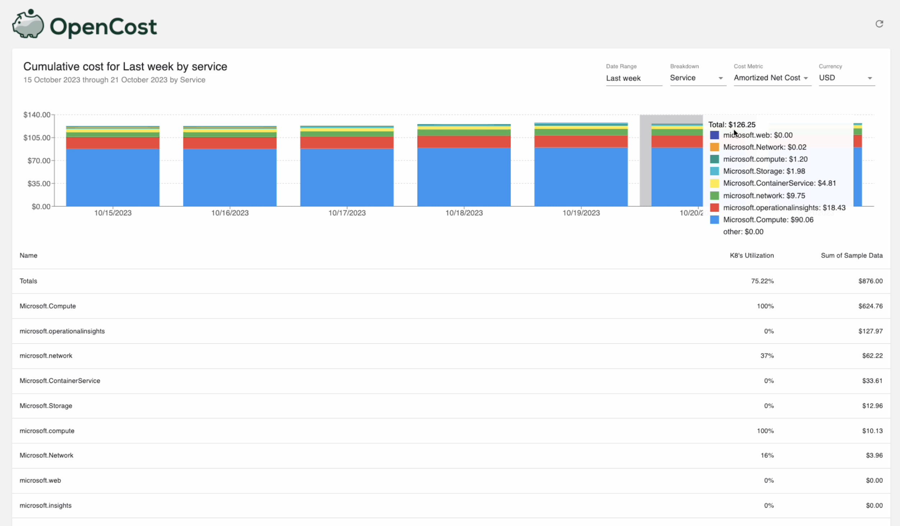
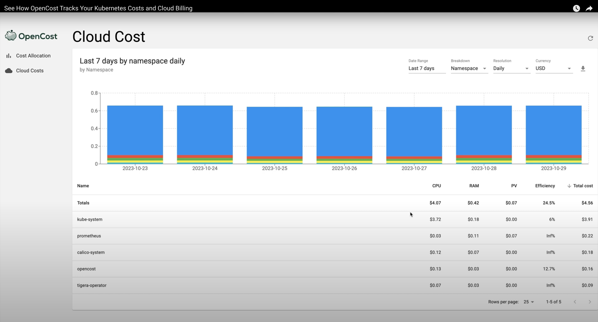

We are thrilled to announce that OpenCost is expanding beyond Kubernetes (K8s) cost monitoring to provide a fully open source cloud cost monitoring solution. This marks our first major expansion since becoming a Cloud Native Computing Foundation (CNCF) project in 2021.

In an era where cloud computing has become an integral part of most businesses, keeping track of infrastructure costs can be a daunting task. This is becoming even more challenging with the growing use of shared infrastructure, multi-cloud and an ever increasing number of other infrastructure solutions. As the complexity of cloud environments expands, there is a pressing need for unified and open solutions that provide a clear and normalized view of all infrastructure expenditures. That's where we see OpenCost playing an increasingly key role.

*OpenCost UI now allows you to monitor cloud cost by service, tag, and more. It also provides the ability to drill down all the way to individual item level*

<!--truncate-->

## Multi-Cloud Cost Monitoring

OpenCost's new multi-cloud cost monitoring solution offers a seamless experience for managing costs across various cloud platforms. With an easy to use interface and simple APIs, OpenCost lets you monitor your cloud expenses on Google Cloud, Amazon Web Services (AWS), and Microsoft Azure in a unified view. And that's just the beginning – we aim to support an increasing number of platforms (e.g. Datadog, MongoDB, etc) in the near future!

Before we delve into why this expansion is important for the OpenCost project, let's take a look at OpenCost multi-cloud cost monitoring in action. Check out our simple demo video to get a glimpse of how this new solution can give you a unified and customizable cloud cost monitoring experience.

*Watch the Video*

This initial launch provides users with the ability to aggregate costs by multi-dimensions, view different cost metrics, filter by various dimensions (e.g. tags, services) and more.

## Getting Started with OpenCost

To get started, simply [deploy OpenCost](https://www.opencost.io/docs/installation/install) and add any number of [cloud accounts](https://www.opencost.io/docs/configuration/#cloud-costs) to see a unified view of all costs. You can view [OpenCost documentation](https://www.opencost.io/docs/) to learn about APIs usage and more.

## Why Is This Important?

In today's diverse cloud landscape, organizations often find themselves managing multiple cloud accounts and/or providers simultaneously. This can lead to a fragmented view of expenses, making it challenging to optimize resources and control costs effectively. OpenCost's multi-cloud cost monitoring solution addresses this issue by providing a single, consolidated interface to normalize and monitor all your cloud costs. This unified perspective simplifies decision-making, cost allocation, and ultimately resource optimization. We believe that having a single view of costs is a critical capability for teams operating a business at medium or large scale built on cloud infrastructure.

Additionally, as cloud environments continue to evolve, there's an increasing demand for monitoring various cost types beyond basic cloud infrastructure. The OpenCost community recognizes this need and intends to extend its customizable interface for other cost types in the near future. We are excited to see the OpenCost community continue to play a significant role in shaping and expanding these capabilities.

## Adopting FOCUS Standards

OpenCost not only offers a unified cost monitoring solution but also embraces emerging industry standards. We are proud to announce that we will be implementing the FinOps Open Cost and Usage Specification (FOCUS) being created with community input and the FinOps Foundation. The work being done on this effort will be directly reflected in the OpenCost implementation. From Udam Dewaraja, Chairperson for the FinOps Foundations’ FOCUS Working Group, “We’re excited to see open source projects like OpenCost integrate and align around this new specification, which will help extend the benefits of FOCUS to a wider group of users. The FOCUS project continues to gain industry-wide momentum and contributors for its ability to bring together practitioners, cloud service providers, vendors, and consultants around a common specification for presenting cloud cost and usage data.”

## About OpenCost

OpenCost is a Cloud Native Computing Foundation (CNCF) project for monitoring and allocating infrastructure and container costs in real time. Our expansion into multi-cloud cost monitoring was made possible through collaboration and contributions from industry leaders. We extend our gratitude to AWS, Grafana Labs, Microsoft , Kubecost, and many others who played a pivotal role in making this project a reality. Together, we look forward to shaping the future of cloud cost monitoring and governance.

## Conclusion

OpenCost's multi-cloud cost monitoring provides a fully open source approach for organizations seeking a comprehensive, user-friendly, and standards-compliant solution for managing cloud expenses. With a unified interface, support for various cloud providers, and a commitment to continuous improvement, OpenCost is poised to empower businesses in their cloud cost optimization journey. Get started today and take control of your cloud costs like never before!

Come find us at the OpenCost kiosk at KubeCon North America next week to learn more and to share your thoughts on the project or [join the OpenCost community](https://www.opencost.io/docs/community) to get involved!
