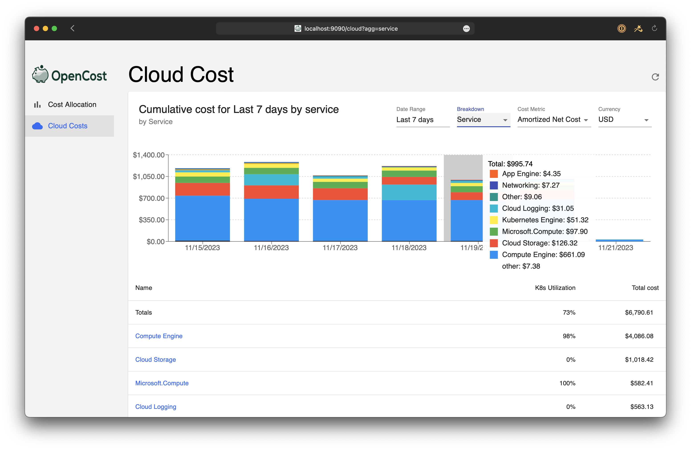

[OpenCost](https://opencost.io)  is an open source implementation for Kubernetes cost monitoring and now cloud cost monitoring for AWS, Azure, and GCP.
The project makes all of this data accessible via an API and user interface.
While discussing the idea of running OpenCost on platforms besides Kubernetes we realized that with this new [Cloud Costs feature](https://www.opencost.io/blog/cloud-costs) there are users who want API access to their cloud billing data without needing to run on Kubernetes.
I opened the Issue [OpenCost without Kubernetes #2268](https://github.com/opencost/opencost/issues/2268) and as luck would have it, we had our internal Hackathon last week.

If you're not familiar with [OpenCost](https://opencost.io), it's the open source CNCF project for monitoring Kubernetes and cloud spending.
It's a Golang implementation of the [OpenCost Specification](https://www.opencost.io/docs/specification) for monitoring Kubernetes cloud costs.
It has an optional web UI and you can also run it as a Prometheus metrics exporter.
The code is all at https://github.com/opencost/opencost and you can learn more about the project at https://opencost.io

<!--truncate-->

## Running OpenCost without Kubernetes

Given that not everyone who wants to look at their cloud billing is using Kubernetes, to run without Kubernetes you can either run from Docker or directly from the CLI. There are 3 environment variables you'll need to set:
* `KUBERNETES_ENABLED=false` (default is `true`)
* `CLOUD_COST_ENABLED=true` (default is `false` since it's beta)
* `CLOUD_COST_CONFIG_PATH=/path/to/file` - you'll need to [provide your credentials](https://www.opencost.io/docs/configuration/) in a file (default is `cloud-integration.json`). [Here’s an example file](https://gist.github.com/mattray/090a43aa4e64f8fc78572cd8d504a4b7).

### Running with Docker

If you want to run with Docker, you can pull down the image from [docker.io/mattray/opencost:k8sless](https://hub.docker.com/repository/docker/mattray/opencost/tags) (or build it yourself).

`docker pull mattray/opencost:k8sless`

and run it with

`docker run -e KUBERNETES_ENABLED=false -e CLOUD_COST_ENABLED=true -e CLOUD_COST_CONFIG_PATH=/tmp/cloud-integration.json -p 9003:9003 -d -v /tmp:/tmp mattray/opencost:k8sless`

### Building and Running from the CLI

You can [check out the code](https://github.com/mattray/opencost/tree/cloudclost-k8sless) and run `make` to build.

To test it, run:

`KUBERNETES_ENABLED=false CLOUD_COST_ENABLED=true CLOUD_COST_CONFIG_PATH='cloud-costs.json' ./costmodel`

## Accessing the Cloud Costs API

The OpenCost [Cloud Cost API](https://www.opencost.io/docs/integrations/api#cloudcost) is exposed on port 9003, you test with

`curl -G http://localhost:9003/cloudCost -d window=7d -d aggregate=provider | jq`

The [Cloud Cost API](https://www.opencost.io/docs/integrations/api#cloudcost) provides the available query parameters and the [API Examples](https://www.opencost.io/docs/integrations/api-examples#cloudcost-examples) show how you could query the Services by your Provider or how to get billing items over a range of time. There are more Cloud Cost API endpoints available in the code, the documentation hasn’t kept up with all the new options so far.

## Using the OpenCost UI from Docker

The OpenCost UI for Cloud Costs is still under development, but you can grab the beta build with

`docker pull mattray/opencost-ui:docker-ui`

and run it from Docker without Kubernetes:

`docker run -p 9090:9090 -d mattray/opencost-ui:docker-ui`

Go to [http://localhost:9090/cloud](http://localhost:9090/cloud) to check it out. The **Cost Allocation** tab will be empty because there’s no Kubernetes data, but the **Cloud Costs** should have whatever clouds you’ve configured access.

The OpenCost UI already works for local development, you can find instructions [here](https://github.com/opencost/opencost/tree/develop/ui#running-locally).

## Walkthrough

If you’d rather just see a quick demo, I’ve recorded a screencast walking through the above steps and connecting with the UI.

<iframe width="840" height="472" src="https://www.youtube.com/embed/rEBaOaHqrK4?si=-mR5lfC9aYHkhPR2" title="OpenCost Cloud Costs with Docker" frameborder="1" allow="accelerometer; autoplay; clipboard-write; encrypted-media; gyroscope; picture-in-picture; web-share" allowfullscreen></iframe>

## Code Changes

This should get merged soon, but if you want to work with the branch it’s available here: https://github.com/mattray/opencost/tree/cloudclost-k8sless ([build instructions](https://github.com/opencost/opencost/blob/develop/CONTRIBUTING.md#building-opencost)). The OpenCost PR is here: [opencost/opencost#2317](https://github.com/opencost/opencost/pull/2317)

I tested on MacOS with Docker (and EKS, K3s, and Kind for regression-checking), but it probably would work on any Unix-compatible platform (Windows?).

## Next Steps

I think there are a lot of use cases we're not aware of yet and hopefully this will get more folks interested in the project. We'll continue expanding documentation on the [Cloud Costs API](https://www.opencost.io/docs/integrations/api#cloudcost) and providing more [examples](https://www.opencost.io/docs/integrations/api-examples#cloudcost-examples) as it continues to mature. If you're involved in [FinOps](https://www.finops.org) we'll be adding support for the upcoming [FOCUS specification](https://focus.finops.org) for standardized billing, so that will make this even more compelling. Let me know what you think, looking forward to any feedback on how to get cloud billing data available in useful formats to even more people.

If you have any questions, email us at opencost@kubecost.com,  join us in [CNCF #opencost Slack](https://slack.cncf.io), or check out the [OpenCost Community page](https://www.opencost.io/docs/community).
