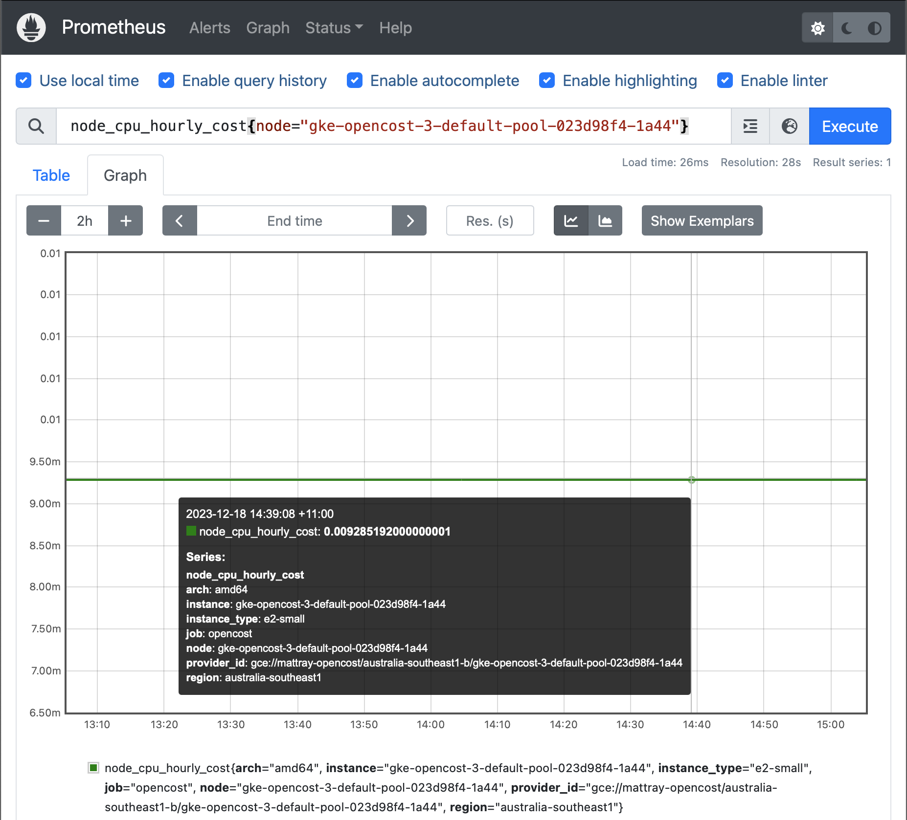

Using OpenCost as a Prometheus metric exporter has long been a [supported use case](https://www.opencost.io/docs/integrations/opencost-exporter), but now you can get this from the standard [Prometheus Community Helm Charts repository](https://github.com/prometheus-community/helm-charts). OpenCost is the open source CNCF project for monitoring cloud and Kubernetes infrastructure costs. For users who want to [export various cost metrics](https://www.opencost.io/docs/integrations/prometheus#available-metrics) from OpenCost without setting up any other OpenCost dependencies, the [Prometheus OpenCost Exporter](https://github.com/prometheus-community/helm-charts/tree/main/charts/prometheus-opencost-exporter) makes it easy to get up and running with minimal steps. If you’re using [Helm](https://helm.sh/) already, it’s as simple as

<!--truncate-->

**Add the Helm Chart Repository**

```
helm repo add prometheus-community https://prometheus-community.github.io/helm-charts
helm repo update
```

**Install the Chart**

```
helm install [RELEASE_NAME] prometheus-community/prometheus-opencost-exporter
```

And this will install the latest version of the Prometheus OpenCost Exporter (currently 1.107.1). The Prometheus OpenCost Exporter will be kept in sync with future releases of OpenCost going forward. If you want to change any of the default settings, you can provide your own [values.yaml](https://github.com/prometheus-community/helm-charts/blob/main/charts/prometheus-opencost-exporter/values.yaml) as necessary.



For detailed information on leveraging the OpenCost Exporter within Prometheus, check out the [OpenCost Prometheus Exporter documentation](https://www.opencost.io/docs/integrations/opencost-exporter) and the list of [available metrics](https://www.opencost.io/docs/integrations/prometheus#available-metrics). It’s easier than ever to get OpenCost deployed for your specific environment requirements, we look forward to solving even more use cases in the future! Join us in the [OpenCost community](https://www.opencost.io/docs/community) and help build our open source community!
