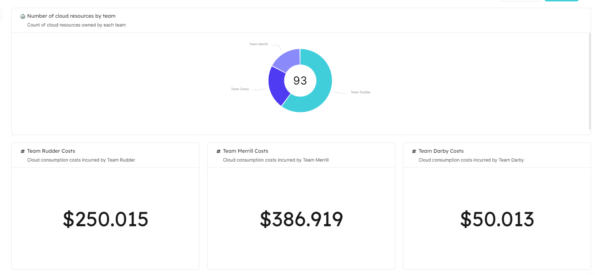

<head>
    <link rel="canonical" href="https://www.getport.io/blog/port-opencost-bringing-open-source-cost-monitoring-for-cloud-native-environments-to-developers"/>
</head>

Reposted from the [Port blog](https://www.getport.io/blog/): [Port & OpenCost: Bringing open source cost monitoring for cloud native environments to developers](https://www.getport.io/blog/port-opencost-bringing-open-source-cost-monitoring-for-cloud-native-environments-to-developers)

[Port](https://www.getport.io) officially integrates with OpenCost. This brings together [OpenCost data and Port’s internal developer portal](https://docs.getport.io/build-your-software-catalog/sync-data-to-catalog/cloud-cost/opencost/#cost), providing developers with the autonomy to understand and manage the cost associated with their work as well as providing managers with alerts, scorecards and initiatives that make it much easier to control costs.

## Who are Port and OpenCost?

<!--truncate-->

OpenCost is a vendor-neutral open source project from the Cloud Native Computing Foundation for measuring and allocating cloud infrastructure and container costs in real time. Built by Kubernetes experts and supported by Kubernetes practitioners, OpenCost shines a light into the black box of Kubernetes and cloud spend.

Port is an open internal developer portal, owned by platform engineering teams and built for developers. Port consolidates everything developers need to know and execute to deliver software autonomously and to comply with organizational standards. Internal developer portals such as Port are gaining popularity since the need to create an end-to-end unified developer experience became obvious, due to the increasing complexity of cloud native application development.

Unlocking new possibilities together

As part of the platform engineering movement there is a focus on bringing everything in one place, so developers can become autonomous and managers can easily track engineering standards compliance. This is also relevant to cost data, with the goal of making developers more cost aware since  they are the ones who build the applications and are therefore responsible to optimize them, also in terms of cost, both for the production environment and in earlier stages of the SDLC.

However, cloud cost reports are not developer friendly,  and can be overwhelming since it is difficult to relate the cost of a cloud service to an application.

When you integrate OpenCost data into a developer portal you’re presenting cost data in the central place that developers use to access anything SDLC. Showing cost data to developers, in context of the cloud environment and services they are developing provides developers with easy to understand data that they can act upon, and immediately see if something is amiss.

The OpenCost integration not only displays cost per service but also per namespace and can break down the cost to CPU, memory, load balancer, network cost etc.  Managers can use it to understand costs by business units or teams, saving them the need to dig into complex reports. As OpenCost continues to add more cloud billing coverage we'll continue to look for ways to expand the integration for our users.

To learn more about the integration, go here
https://docs.getport.io/build-your-software-catalog/sync-data-to-catalog/cloud-cost/opencost/
