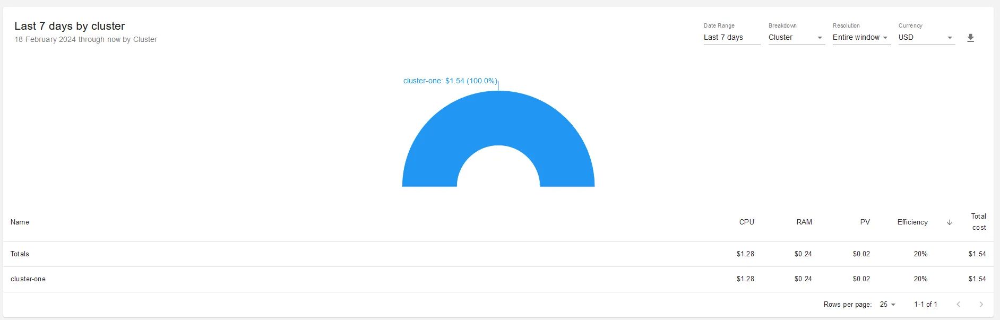

<head>
    <link rel="canonical" href="https://medium.com/oracledevs/announcing-opencost-support-for-oci-f1a4cf45ae03"/>
</head>

Reposted from the [Oracle Developers series](https://medium.com/oracledevs/announcing-opencost-support-for-oci-f1a4cf45ae03) by Ali Mukadam: [Announcing OpenCost support for OCI](https://medium.com/oracledevs/announcing-opencost-support-for-oci-f1a4cf45ae03)


It’s a fact now that Kubernetes has won the container wars. It has fought off Docker, Mesos, OpenStack and a number of other clustering and orchestration technologies to become the de-facto Cloud Operating System. Heck, [Kubernetes has even made it to F-16s](https://thenewstack.io/how-the-u-s-air-force-deployed-kubernetes-and-istio-on-an-f-16-in-45-days/). You say Maverick is an ace? He’s got nothing on those F-16s pilots who are able to fly a cloud within clouds at Mach 2. I’m jealous of those pilots.

<!--truncate-->


Almost every type of workload now runs on Kubernetes. At Oracle, we are constantly striving to make the numerous software we build a first-class citizen of Kubernetes and the cloud-native ecosystem.

For those software that are foundational pieces which other applications rely on, we create [Kubernetes operators](https://kubernetes.io/docs/concepts/extend-kubernetes/operator/) for them e.g.

* Databases: [Oracle Database](https://github.com/oracle/oracle-database-operator), MySQL.
* In-memory data grid: [Coherence](https://github.com/oracle/coherence-operator).
* Application servers: [WebLogic](https://github.com/oracle/weblogic-kubernetes-operator).

For applications, we either build containerized versions of them or we evolve them and run them in a semi-microservices style e.g. [Siebel](https://docs.oracle.com/en/solutions/deploy-siebel-oke-oci/index.html#GUID-ADB72E84-2DC7-4331-9D1B-3A0F947740CC). The benefits for customers are quite obvious:

* Run in the cloud (hopefully you choose Oracle Cloud).
* Lean on Oracle Cloud and Kubernetes to scale your workloads when you need to.
* Embrace modern software engineering architectures, methodologies, culture and practices.
* Modernize your IT infrastructure and application landscape at your own pace.
* Run more recent “cloud-native” workloads such as micro-services, AI/ML, serverless, observability etc alongside your traditional Oracle workloads.

And finally, we also [contribute to CNCF projects](https://www.cncf.io/blog/2024/02/02/oracle-oci-credits-are-now-available-to-cncf-projects-here-is-what-you-need-to-know/) to enable our customers to use these projects smoothly, especially on Oracle Cloud and OKE. However, our contribution to CNCF is more than just financial. [My colleague Mickey Boxell has led the Kubernetes documentation release team](https://www.linkedin.com/feed/update/urn:li:activity:7075130044678881280?updateEntityUrn=urn%3Ali%3Afs_feedUpdate%3A%28V2%2Curn%3Ali%3Aactivity%3A7075130044678881280%29), we have added support to [Thanos and OCI Object Storage](https://medium.com/oracledevs/deploy-thanos-receive-with-native-oci-object-storage-on-kubernetes-829326ea0bc6), external-dns and we have recently made [Istio](https://istio.io/) available [as a native OKE addon](https://medium.com/oracledevs/cross-region-file-replication-with-longhorn-in-oracle-cloud-and-kubernetes-de5a5b82e4b7).

All this is a long-winded way to announce that we have contributed to [OpenCost](https://www.opencost.io/) and [added support for Oracle Cloud](https://www.opencost.io/blog/opencost-1.109), courtesy of my colleague [Anders Swanson](https://github.com/anders-swanson).

## What is OpenCost?

From the horse’s mouth:

***OpenCost is a vendor-neutral open source project for measuring and allocating cloud infrastructure and container costs in real time. Built by Kubernetes experts and supported by Kubernetes practitioners, OpenCost shines a light into the black box of Kubernetes spend.***

Using OpenCost, you should be able to track the cost of running any Kubernetes clusters running on Oracle Cloud:

* OKE: Oracle’s managed Kubernetes service
* user-managed: Kubernetes that you run yourself e.g. [OCNE](https://docs.oracle.com/en/operating-systems/olcne/), [K3s](https://medium.com/@lmukadam/k3s-on-oci-a-kubernetes-cluster-in-under-5-mins-d7c194c19d59) on Oracle Cloud

For the purpose of this article, we’ll use OKE. As I mentioned in a [previous post](https://medium.com/oracledevs/announcing-release-of-terraform-oke-kubernetes-module-5-0-part-2-dca5bdd14c6b), you now have an astounding range of options to run your various workloads on OKE. From traditional Intel-based node pools to bare metal computes to HPC shapes running on ultra-low latency RDMA cluster network (very handy if you are in the AI/ML business), you can run them all on OKE and let us worry about the heavy lifting for you.

However, whenever Kubernetes and AI/ML are mentioned to customers, many users tend to picture thousands of servers and an astronomical sum to run these and are as a result, quite apprehensive to jump on the train. Well, [you are still not running a planetary search engine](https://blog.bradfieldcs.com/you-are-not-google-84912cf44afb) so it’s very unlikely that you have such a massive bill to foot.

With OpenCost support for OCI, you can now have a better visibility of these costs and thus be a lot more judicious when planning your cluster.

Let’s get started.

## Installing OpenCost on OKE

Use the [Terraform module for OKE](https://github.com/oracle-terraform-modules/terraform-oci-oke) to create a cluster. We’ll create a small cluster of 1 node pool and 3 worker nodes to get started. OpenCost requires [Prometheus](https://prometheus.io/) so let’s follow the guide install it:
```
helm install prometheus — repo https://prometheus-community.github.io/helm-charts prometheus \
--namespace prometheus-system — create-namespace \
--set prometheus-pushgateway.enabled=false \
--set alertmanager.enabled=false \
 -f https://raw.githubusercontent.com/opencost/opencost/develop/kubernetes/prometheus/extraScrapeConfigs.yaml
```
Let’s now install OpenCost:
```
kubectl apply — namespace opencost -f https://raw.githubusercontent.com/opencost/opencost/develop/kubernetes/opencost.yaml
```
We can now test OpenCost:
```
kubectl port-forward --namespace opencost service/opencost 9003:9090
```
And we can see a nice chart giving us a breakdown of running OKE:



We can also see a more detailed breakdown by containers:


But how do we know it’s really picking up the Oracle Cloud pricing? Retrieve the OpenCost pod name:
```
kubectl -n opencost get pods

NAME                        READY   STATUS    RESTARTS   AGE
opencost-794c54d566-5sh45   2/2     Running   0          42s
```

And check the logs:
```
kubectl logs -f opencost-794c54d566-5sh45

2024-02-24T13:43:16.091546797Z ??? Log level set to info
2024-02-24T13:43:16.091621789Z INF Starting cost-model version dev (HEAD)
2024-02-24T13:43:16.091708313Z INF Prometheus/Thanos Client Max Concurrency set to 5
2024-02-24T13:43:16.096096365Z INF Success: retrieved the 'up' query against prometheus at: http://prometheus-server.prometheus-system.svc
...
2024-02-24T13:43:16.205189991Z INF Found ProviderID starting with "oracle", using Oracle Provider
```
You can see it’s now found the ProviderID to be Oracle.

I would like to conclude by thanking my colleague Anders Swanson for his contribution to make this possible. If you have ideas and suggestions about how we can make OpenCost work better for you especially on OCI, please do not hesitate to reach out to us.
