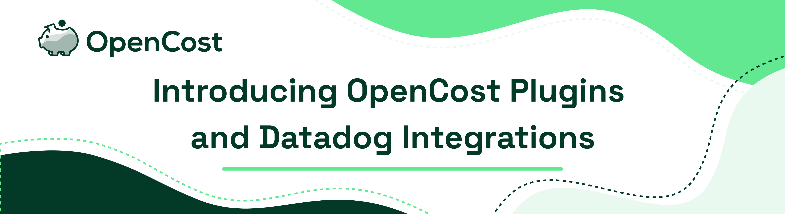

We are excited to announce that the CNCF [OpenCost](https://opencost.io) project has significantly expanded its scope and capabilities beyond existing Kubernetes and cloud costs monitoring into Datadog and other costs. Via the new OpenCost Plugins launch, OpenCost now integrates with Datadog’s cost APIs, providing comprehensive cost monitoring capabilities to developers, FinOps practitioners, platform engineers, and anyone else who might value access to this data in your organization. OpenCost is launching this extensible cost plugin framework so that anyone can add a cost integration of their choice. This expansion is the next major step in OpenCost’s journey to empower teams of all sizes with unified cost monitoring and insights into their infrastructure spending across their platforms.

<!--truncate-->

The initial Datadog integration is built on the new [OpenCost Plugins](https://github.com/opencost/opencost-plugins) framework that makes extending OpenCost’s coverage into new IT cost sources (infrastructure monitoring, data platforms, cloud services, and other tools) available to the open source community. Support is now available in the OpenCost 1.110 release. Initial installation instructions are [available here](https://www.opencost.io/docs/integrations/datadog). We’re working on supporting it in the UI and it will be included in the API as well.

Once integrated with your Datadog account, you can access cost information via the following API:

**API Usage:**
* `customCost/total`
  * Used to grab a summary of custom costs over a window
  * Available aggregations:
    * `zone`
    * `accountName`
    * `chargeCategory`
    * `description`
    * `resourceName`
    * `resourceType`
    * `providerId`
    * `usageUnit`
    * `domain`
    * `costSource`
  * The available filters are the same as the available aggregations. For example:
    * `filter=domain:”datadog”`
    * `filter=zone:”us”`
    * `filter=resourceType:”infra_hosts”`
* `customCost/timeseries`
  * Essentially equivalent to calling /total over a range of time steps. For example, querying for the past 7 days will give you a /total response for each of those days, individually
  * All available aggregations and filters are the same as with /total

By ingesting Datadog costs, OpenCost enables users to gain granular visibility into their Datadog usage and associated costs. This enhancement equips developers with the tools they need to optimize resource allocation, identify cost inefficiencies, and ultimately drive more cost-effective operations in an increasingly unified view of spend. With OpenCost's user interface and data access capabilities, developers can effortlessly track and manage their Datadog expenses alongside their Kubernetes and cloud costs, streamlining cost monitoring efforts and facilitating smarter decision-making processes.

Datadog is just the first of many expected integrations. If there are other external data sources you would like (or would like to work on), join us in the OpenCost Community Slack (https://slack.cncf.io #opencost) or you can view documentation on [Creating a new OpenCost Plugin](https://github.com/opencost/opencost-plugins?tab=readme-ov-file#creating-a-new-plugin). Let’s build something together!
