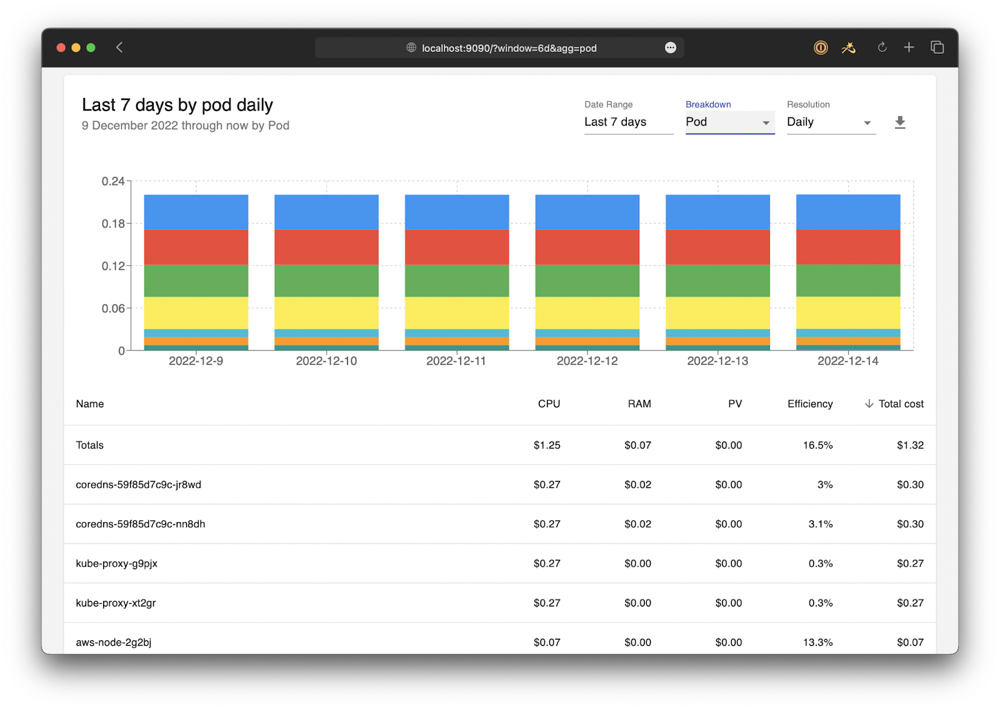

We are excited to announce that the CNCF OpenCost project has significantly expanded its scope and capabilities beyond existing Kubernetes and cloud costs monitoring. Via the new [OpenCost Plugins](https://github.com/opencost/opencost-plugins) framework, teams are now able to use OpenCost to monitor ALL of their IT spending (infrastructure monitoring, data platforms, cloud services or other tools) in one place. We have kicked things off with a Datadog plugin, but this is just the first of many plugins coming to OpenCost.

The new 1.110 release of OpenCost is a huge milestone in the project’s mission to deliver granular, real-time IT costs to the world. Already the leading project for monitoring the costs for Kubernetes and Cloud Services, OpenCost’s new Plugin architecture will provide comprehensive, unified cost monitoring capabilities to developers, FinOps practitioners, platform engineers, or anyone in your organization who values monitoring the cost of your IT resources.



The plugin framework for adding additional cost sources to OpenCost is flexible enough to allow for cost monitoring from a wide range of tools and services – it supports new costs that conform to the [FOCUS spec](https://focus.finops.org/) developed by the FinOps Foundation to ensure costs are shown in a consistent way. If you are interested in a plugin to monitor your resources, you can review the process for [adding a new plugin](https://github.com/opencost/opencost-plugins?tab=readme-ov-file#creating-a-new-plugin) and make a contribution, or [open an issue](https://github.com/opencost/opencost-plugins/issues) requesting a new plugin. Any contributor who adds a new plugin to OpenCost will receive a box full of OpenCost swag and $1000! If you have any issues or questions you can [join our slack community](https://slack.cncf.io/) or email us at [opencost@kubecost.com](mailto:opencost@kubecost.com). 

To kick things off, we have created the first OpenCost plugin for Datadog cost monitoring! OpenCost 1.110 users are now able to monitor what it costs them to run Datadog’s various services in real time right alongside their monitoring of costs from Kubernetes and Cloud Services. Simply [install the Datadog plugin](https://www.opencost.io/docs/integrations/datadog), and you are able to slice and dice your Datadog costs however you want – by Account, Resource Type, Resource Name, etc. This granular, real-time visibility makes it easy to understand your costs by business unit (team, application, etc.), quickly identify increases in spend, and ensure you are spending money efficiently.   

Below you can see how the new OpenCost API’s can be used to view costs from the configured plugins. For example, once you’ve [integrated your Datadog account](https://www.opencost.io/docs/integrations/datadog), you can access Datadog cost information via the following APIs:

* customCost/total
    * Used to grab a summary of custom costs over a window
    * Available aggregations:
        * zone
        * accountName
        * chargeCategory
        * description
        * resourceName
        * resourceType
        * providerId
        * usageUnit
        * domain
        * costSource
    * The available filters are the same as the available aggregations. For example:
        * filter=domain:”datadog”
        * filter=zone:”us”
        * filter=resourceType:”infra_hosts”
* customCost/timeseries
    * Essentially equivalent to calling /total over a range of time steps. For example, querying for the past 7 days will give you a /total response for each of those days, individually
    * All available aggregations and filters are the same as with /total


Below are some examples of these APIs in action.

_Totals request, aggregating by domain over the past 7 days:_

```
https://nightly.opencost.io/model/customCost/total?window=7d&aggregate=domain
```

Response:

```
{
  "code": 200,
  "data": {
    "window": {
      "start": "2024-03-14T00:00:00Z",
      "end": "2024-03-21T00:00:00Z"
    },
    "totalBilledCost": 147.37999,
    "totalListCost": 186.98547,
    "customCosts": [
      {
        "id": "",
        "zone": "us",
        "account_name": "Kubecost",
        "charge_category": "",
        "description": "",
        "resource_name": "",
        "resource_type": "",
        "provider_id": "",
        "billedCost": 147.37999,
        "listCost": 186.98547,
        "list_unit_price": 0.082197905,
        "usage_quantity": 120,
        "usage_unit": "",
        "domain": "datadog",
        "cost_source": "observability",
        "aggregate": "datadog"
      }
    ]
  }
}
```


_Totals request, aggregating by providerId over the past 7 days:_


```
https://nightly.opencost.io/model/customCost/total?window=7d&aggregate=providerId
```

Response:

```
{
  "code": 200,
  "data": {
    "window": {
      "start": "2024-03-14T00:00:00Z",
      "end": "2024-03-21T00:00:00Z"
    },
    "totalBilledCost": 147.37999,
    "totalListCost": 186.98546,
    "customCosts": [
      {
        "id": "",
        "zone": "us",
        "account_name": "Kubecost",
        "charge_category": "usage",
        "description": "350+ integrations, alerting, custom metrics & unlimited user accounts",
        "resource_name": "agent_host_count",
        "resource_type": "infra_hosts",
        "provider_id": "42c0ac62-8d80-11ed-96f3-da7ad0900005/agent_host_count",
        "billedCost": 0,
        "listCost": 8.876712,
        "list_unit_price": 0.073972605,
        "usage_quantity": 360,
        "usage_unit": "Infra Host - hours",
        "domain": "datadog",
        "cost_source": "observability",
        "aggregate": "42c0ac62-8d80-11ed-96f3-da7ad0900005/agent_host_count"
      },
      {
        "id": "",
        "zone": "us",
        "account_name": "Kubecost",
        "charge_category": "usage",
        "description": "Centralize your monitoring of systems and services (Per Container)",
        "resource_name": "container_count_excl_agent",
        "resource_type": "infra_hosts",
        "provider_id": "42c0ac62-8d80-11ed-96f3-da7ad0900005/container_count_excl_agent",
        "billedCost": 0,
        "listCost": 19.80274,
        "list_unit_price": 0.0041095894,
        "usage_quantity": 14456,
        "usage_unit": "Container - hours",
        "domain": "datadog",
        "cost_source": "observability",
        "aggregate": "42c0ac62-8d80-11ed-96f3-da7ad0900005/container_count_excl_agent"
      }
...
    ]
  }
}
```

Datadog is just the first of many plugins! If you are interested in a plugin to monitor your resources, you can review the process for [adding a new plugin](https://github.com/opencost/opencost-plugins?tab=readme-ov-file#creating-a-new-plugin) and make a contribution, or [open an issue](https://github.com/opencost/opencost-plugins/issues) requesting a new plugin. Contributors who add a plugin which is accepted into Opencost will receive swag and $1000! If you have any issues or questions you can [join our slack community](https://slack.cncf.io/) or email us at [opencost@kubecost.com](mailto:opencost@kubecost.com).  

Let’s build something together!