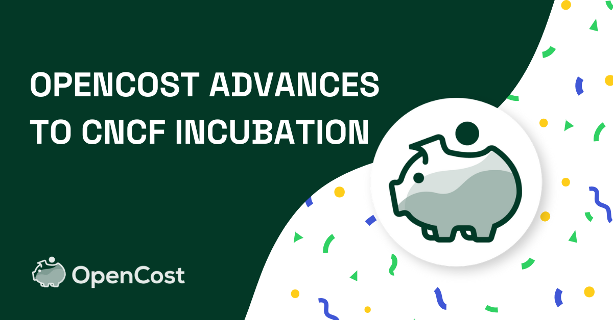

The OpenCost project proudly announces that we’ve reached CNCF Incubating status! This milestone in our journey underscores the significant dedication the project has received from the community that contributes to OpenCost. We’d like to thank the developers, Kubernetes practitioners, and FinOps teams from organizations across the globe that continue to make this project meaningful.

<!--truncate-->

Cloud-native adoption continues accelerating, and the need for clear, manageable insights into Kubernetes costs keeps pace. OpenCost addresses this need as an open-source tool designed to make Kubernetes cost management more accessible and standardized. Initially launched through a collaborative effort led by Kubecost and supported by experts from organizations like Amazon, Adobe, Google, Microsoft, and SUSE, OpenCost was welcomed into the CNCF Sandbox to improve cost management for Kubernetes. Our promotion to CNCF Incubation reflects strong community support and the important challenges it seeks to address.

## The Importance of OpenCost
OpenCost fills a critical gap by providing real-time visibility into Kubernetes costs across multi-cloud environments. With its vendor-neutral framework, OpenCost enables teams to allocate costs by Kubernetes service, deployment, container, and more. By standardizing cost allocation, OpenCost helps reduce cost overruns and gives teams a trusted model for budget planning, regardless of whether they use AWS, Google Cloud, Microsoft Azure, or on-premises infrastructure.

## From Sandbox to Incubating
Progressing from Sandbox to Incubation within the CNCF represents a vote of confidence from the cloud-native and open-source communities. Projects that reach this status are celebrated for their innovation and reliability, and they signal the potential for widespread adoption. For OpenCost, this transition validates our project’s solutions to Kubernetes cost challenges and recognizes the tool as becoming foundational for Kubernetes cost management at scale.

## Key Milestones for OpenCost
OpenCost’s growth has been remarkable. Here are some notable highlights:
* Broader Platform Integration: OpenCost has integrated with major cloud providers’ billing APIs and supports Prometheus for seamless cost data exporting.
* Community-Driven Development: A diverse group of contributors from Adobe, Google, SUSE, and many others have significantly contributed to refining OpenCost, with frequent releases that keep it flexible, effective, and secure.
* Open Source Plugin Framework: [OpenCost Plugins](https://github.com/opencost/opencost-plugins) were added to allow for cost monitoring of tools and services like Datadog, OpenAI, and MongoDB Atlas.
* FinOps Certification: By aligning with the FinOps Foundation, OpenCost supports Kubernetes FinOps practitioners seeking to optimize their Kubernetes costs.

## OpenCost Momentum
As an Incubating project, OpenCost’s future is bright and filled with opportunities to expand its capabilities. We look forward to developing new integrations, refining real-time cost monitoring, and offering deeper support for multi-cloud and hybrid-cloud environments. Our progress depends on the community of users, and we invite anyone interested in Kubernetes cost management to join us in building a sustainable, transparent future for Kubernetes operations.

## Help Shape the Future of OpenCost
OpenCost is powered by the passion and expertise of our community. We encourage you to explore OpenCost on [GitHub](https://github.com/opencost) and chat with us on [CNCF Slack](https://cloud-native.slack.com/). Together, we’re creating an essential tool for Kubernetes teams worldwide, helping them manage cloud costs more effectively and transparently. Are you going to Kubecon NA 2024? Stop to say ‘hi’ at the OpenCost kiosk in the CNCF Project Pavillion.

