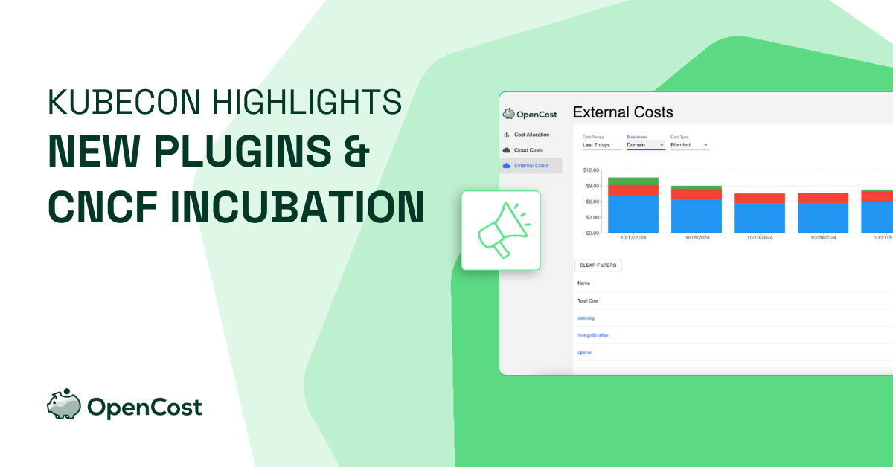
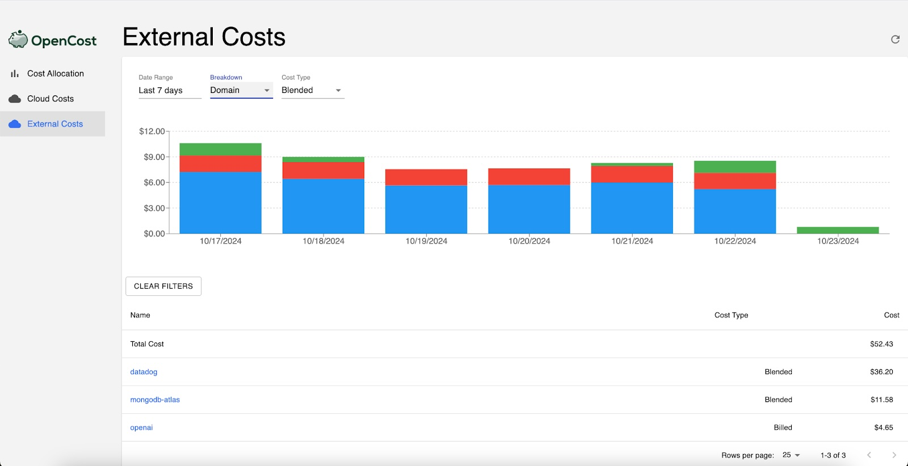

At last week’s KubeCon North America, OpenCost shared exciting updates about our project, including our new status as a CNCF Incubating Project! 
This milestone underscores our commitment to open-source excellence and the trust the community has placed in OpenCost as a leading solution for Kubernetes cost management. 
In this post, we’ll recap the Kubecon highlights, including details on our latest plugins, upcoming integrations, and our $1,000 reward for accepted community plugin contributions.
Check out Alex Meijer’s KubeCon session on OpenCost plugins [here on YouTube](https://www.youtube.com/watch?v=yLAx2z4FqSk).

## New Plugins: Datadog, MongoDB Atlas, and OpenAI

If you didn’t hear the news already at Kubecon, we’ve released several new plugins to expand OpenCost’s integrations with essential tools and platforms. Here’s a look at the capabilities each plugin brings:
1. Datadog Plugin: This plugin enables users to view and track Datadog’s costs directly within OpenCost. By consolidating Datadog expenses alongside Kubernetes workloads, 
users gain a comprehensive view of monitoring-related expenses, making it easier to manage observability costs in the context of total infrastructure spending.
2. MongoDB Atlas Plugin: For teams using MongoDB Atlas as a managed database service, this plugin provides cost insights directly within OpenCost. By tracking MongoDB resource consumption alongside Kubernetes spending, 
teams get a more unified view of total application costs.
3. OpenAI Plugin: OpenAI’s usage can be unpredictable and often scales rapidly with demand. With this plugin, OpenCost users can analyze and monitor OpenAI API usage costs alongside Kubernetes workloads, 
helping organizations understand and manage the full scope of AI-driven application expenses.

## Plugin Backlog: What’s Coming Next
Our backlog is shaped by community feedback. Below are a few examples of plugins we are looking to build, but you can check out the full backlog on our [GitHub issues page](https://github.com/opencost/opencost-plugins/issues).
- Snowflake: This plugin will enable tracking of Snowflake data warehousing costs, giving insights into data expenses alongside Kubernetes workloads.
- Databricks: With Databricks' popularity for big data processing, this plugin will bring Databricks cost insights into OpenCost, allowing users to manage analytics costs in one place.
- Cloudflare: This plugin will monitor the cost of Cloudflare, providing visibility into network and security-related expenses alongside Kubernetes infrastructure.

## $1,000 Reward for Plugin Contributions
In addition to these updates, OpenCost is inviting community contributions by offering a $1,000 reward + a box of OpenCost swag for each accepted plugin. This reward is part of our commitment to building a robust, 
community-driven ecosystem of cost management tools for Kubernetes. If you have experience with a particular tool or service that could benefit other OpenCost users, we’d love to collaborate with you!

## How to get started with OpenCost Plugins
Visit our [Plugin Docs](https://www.opencost.io/docs/integrations/plugins/) for the full details on how to install OpenCost plugins in your environment. In general, installing a plugin is as simple as:
1. Obtaining the plugin Binary
2. Adding your plugin API keys to the relevant plugin config
3. Watch all your cost data come together in one place!

## Join the OpenCost Community
Thank you to everyone who joined us at KubeCon! OpenCost’s new status as a CNCF Incubating Project represents a significant step forward, and we’re excited to grow with the community. 
For those who missed the session, watch Alex Meijers’ KubeCon talk [here on YouTube](https://www.youtube.com/watch?v=yLAx2z4FqSk) and join us on [GitHub](https://github.com/opencost) to share your feedback and ideas.
Together, let’s build a powerful and open ecosystem for cost management!

