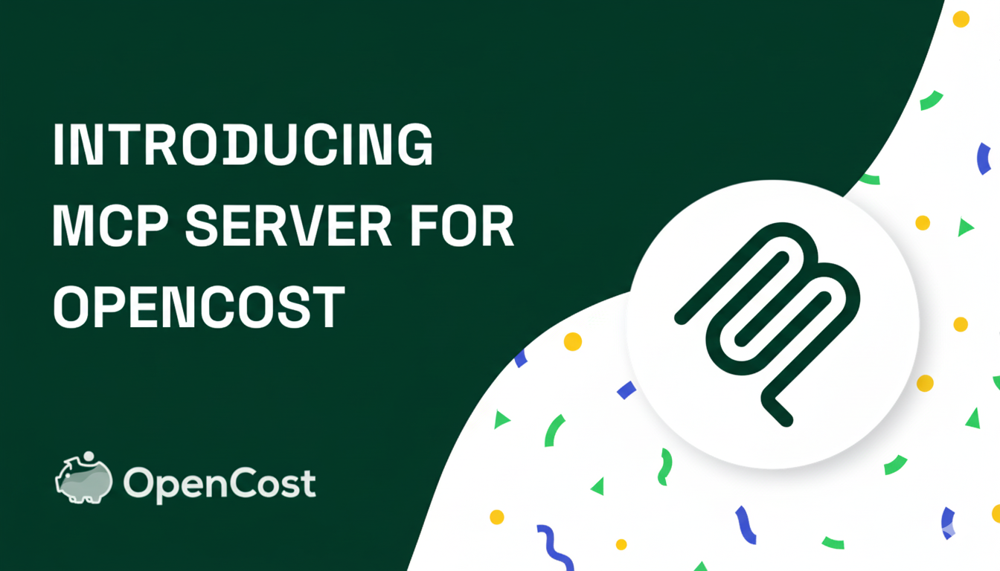
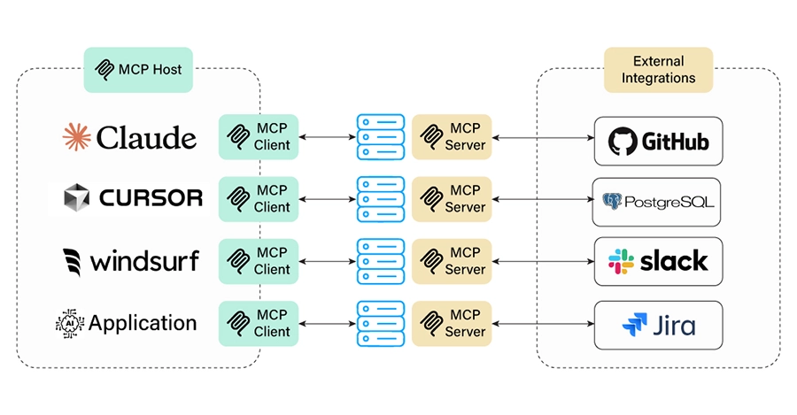

The future of Kubernetes cost management is here, and it's powered by AI. We're excited to announce that OpenCost now includes a built-in **Model Context Protocol (MCP) server** that enables AI agents to directly access and analyze your Kubernetes cost data. This groundbreaking integration brings intelligent automation to cost optimization, making it easier than ever to understand, predict, and optimize your cloud spending.

<!--truncate-->

## What is Model Context Protocol (MCP)?

The Model Context Protocol is an open standard introduced by Anthropic in late 2024 that standardizes how AI systems integrate with external tools and data sources. Think of MCP as a universal translator that allows AI agents to seamlessly interact with your infrastructure, databases, and applications.

For OpenCost, this means AI agents can now:
- **Query cost data** in real-time using natural language
- **Analyze spending patterns** across namespaces, pods, and nodes
- **Generate cost reports** and recommendations automatically
- **Monitor budget alerts** and cost anomalies
- **Optimize resource allocation** based on historical data

## OpenCost MCP Server: Zero-Configuration AI Integration

The best part? OpenCost's MCP server is **enabled by default** in every deployment. No additional setup, no complex configuration—just intelligent cost management out of the box.

### Key Features

- **🚀 Enabled by Default**: MCP server starts automatically with OpenCost
- **🔧 Full User Control**: Easy to disable or configure ports and settings
- **📊 Comprehensive Data Access**: Query allocation, asset, and cloud cost data
- **🌐 HTTP Transport**: Reliable communication with MCP clients
- **☸️ Helm Integration**: Built into the official Helm chart for production deployments
- **🔍 Advanced Filtering**: Filter by provider, service, region, and more

## Available MCP Tools

The OpenCost MCP server provides three powerful tools for AI agents:

### 1. `get_allocation_costs`
Retrieve detailed cost allocation data with advanced filtering and aggregation.

**Example Use Cases:**
- "Show me the cost breakdown by namespace for the last 7 days"
- "Which pods are consuming the most resources in production?"
- "Compare costs between different nodes in my cluster"

**Parameters:**
- `window` (required): Time window (e.g., "7d", "1h", "30m")
- `aggregate` (optional): Group by namespace, pod, node, etc.
- `step` (optional): Resolution step size
- `accumulate` (optional): Whether to accumulate over time
- `share_idle` (optional): Whether to share idle costs
- `include_idle` (optional): Whether to include idle resources

### 2. `get_asset_costs`
Access comprehensive asset information including nodes, disks, load balancers, and more.

**Example Use Cases:**
- "What are my current infrastructure costs?"
- "Show me the cost of all storage volumes"
- "Which load balancers are most expensive?"

**Parameters:**
- `window` (required): Time window for cost analysis

### 3. `get_cloud_costs`
Query cloud cost data with provider, service, and region filtering.

**Example Use Cases:**
- "How much am I spending on AWS EC2 instances?"
- "Compare costs between different regions"
- "Show me the breakdown of GCP services"

**Parameters:**
- `window` (required): Time window
- `aggregate` (optional): Group by provider, service, region
- `provider` (optional): Filter by AWS, GCP, Azure, etc.
- `service` (optional): Filter by specific services
- `region` (optional): Filter by geographic regions

## Supported Asset Types

The OpenCost MCP server provides comprehensive coverage of your infrastructure:

- **🖥️ Node**: Compute instances with CPU, RAM, GPU details
- **💾 Disk**: Storage volumes with usage and cost breakdown
- **⚖️ LoadBalancer**: Load balancer instances with IP and private status
- **🌐 Network**: Network-related costs and usage
- **☁️ Cloud**: Cloud service costs with credit information
- **☸️ ClusterManagement**: Kubernetes cluster management costs

---

*Ready to revolutionize your cost management with AI? Deploy OpenCost and start exploring the possibilities with our built-in MCP server.*
