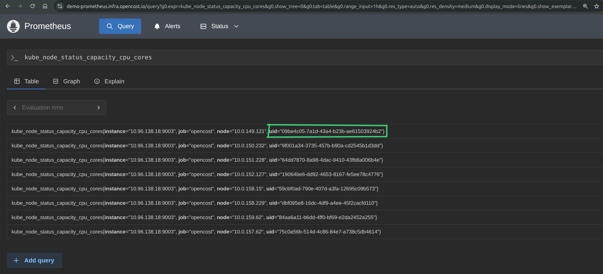

*This project was initiated as part of the LFX Fall 2025 mentorship program at OpenCost and development is ongoing.*

OpenCost is evolving. As Kubernetes environments grow in complexity with pods being recreated, names being reused, and resources constantly shifting, the need for a more robust, scalable data model has become clear. Today, we're excited to introduce **KubeModel**, the foundation of OpenCost's Data Model 2.0, designed to bring precision, efficiency, and reliability to Kubernetes cost tracking.

<!--truncate-->

## The Challenge: Tracking Resources in a Dynamic Environment

Kubernetes is inherently dynamic. Pods come and go, deployments scale up and down, and resource names can be reused across recreation cycles. Traditional metric tracking that relies solely on resource names struggles in this environment for a number of reasons including:

- **Name reuse**: When a pod is recreated with the same name, historical cost data can become ambiguous. This is particularly problematic in stateful set pods.
- **Resource correlation**: Linking metrics across different time windows becomes unreliable.
- **Debugging complexity**: Without stable identifiers, tracing cost anomalies back to specific resource instances is challenging.

KubeModel addresses these challenges head-on with a comprehensive approach to resource identification and tracking.

## What is KubeModel?

KubeModel is a new data model for Kubernetes resource tracking in OpenCost. It introduces a **flat architecture** with core resource types that mirror Kubernetes primitives:

- **Cluster** - The top-level container
- **Namespace** - Logical resource groupings
- **Node** - Compute instances with CPU, RAM, and GPU details
- **Pod** - The fundamental deployment unit
- **Container** - Individual workload containers
- **Owner/Controller** - Deployments, StatefulSets, ReplicaSets, DaemonSets, Jobs
- **Service** - Network service abstractions
- **Volume & PVC** - Persistent storage resources
- **ResourceQuota** - Namespace resource limits and requests
- **KubeModelSet** - A collection of KubeModel resources for a specific time window
- **GPU** - GPU resource tracking *(Coming soon)*

### Flat Architecture for Performance

Unlike nested hierarchies, KubeModel maintains a **flat map-based structure** enabling O(1) lookups while preserving resource relationships through UIDs and references. This design choice prioritizes:

- **Fast access**: Constant-time lookups regardless of cluster size.
- **Clean relationships**: Resources reference each other via stable identifiers.
- **Efficient serialization**: The flat structure translates well to binary formats.
- **Use case agnostic**: Flexible design supports diverse consumption patterns and applications.

Here's the core KubeModelSet structure that holds all resources for a time window:

`core/pkg/model/kubemodel/kubemodel.go`
```go
type KubeModelSet struct {
	Metadata   *Metadata              `json:"meta"`
	Window     Window                 `json:"window"`
	Cluster    *Cluster               `json:"cluster"`
	Namespaces map[string]*Namespace  `json:"namespaces"`
	Containers map[string]*Container  `json:"containers,omitempty"`
	Owners     map[string]*Owner      `json:"owners,omitempty"`
	Nodes      map[string]*Node       `json:"nodes,omitempty"`
	Pods       map[string]*Pod        `json:"pods,omitempty"`
	Services   map[string]*Service    `json:"services,omitempty"`
}
```

Each resource type is stored in a flat map keyed by UID, enabling O(1) lookups while maintaining relationships through UID references between resources.

## UID Support: The Heart of Data Model 2.0

The cornerstone of KubeModel is comprehensive **UID (Unique Identifier) support** across all Kubernetes resources. Every resource in Kubernetes has a UID - a stable, unique identifier that persists for the lifetime of that specific resource instance.


*Figure 1: Prometheus metrics showing UID labels for precise resource identification across queries.*

### Enhanced Metric Tracking

With UID support integrated into OpenCost's metrics, we now have:

- **Stable resource identification** across queries, even when names are reused.
- **Improved cost attribution** to specific resource instances rather than just names.
- **Better multi-cluster support** by preventing resource name conflicts.
- **Enhanced debugging** through stable identifiers throughout the resource lifecycle.

Here's an example of how we track node CPU capacity with UID support:

`pkg/metrics/nodemetrics.go`
```go
type KubeNodeStatusCapacityCPUCoresMetric struct {
	fqName string
	help   string
	cores  float64
	node   string
	uid    string  // <-- UID field for unique resource identification
}

func newKubeNodeStatusCapacityCPUCoresMetric(fqname string, node string, uid string, cores float64) KubeNodeStatusCapacityCPUCoresMetric {
	return KubeNodeStatusCapacityCPUCoresMetric{
		fqName: fqname,
		help:   "kube_node_status_capacity_cpu_cores Node Capacity CPU Cores",
		cores:  cores,
		node:   node,
		uid:    uid,
	}
}

func (nam KubeNodeStatusCapacityCPUCoresMetric) Write(m *dto.Metric) error {
	m.Gauge = &dto.Gauge{
		Value: &nam.cores,
	}
	m.Label = []*dto.LabelPair{
		{
			Name:  toStringPtr("node"),
			Value: &nam.node,
		},
		{
			Name:  toStringPtr("uid"),
			Value: &nam.uid,
		},
	}
	return nil
}
```

The `uid` field is now a first-class citizen in every metric struct. The `Write` method serializes it as a Prometheus label, ensuring every emitted metric carries its resource's unique identifier for precise tracking.

### Implementation Scope

The UID implementation spans the entire OpenCost stack:

- **61+ metric result types** enhanced with UID fields
- **30+ Prometheus queries** updated to include UID in aggregation
- **9 resource types** with comprehensive UID validation
- **31 metrics** covered by integration tests

Resources enhanced include Pods, Deployments, StatefulSets, Services, Namespaces, Nodes, PersistentVolumes, PersistentVolumeClaims, Jobs, and ReplicaSets.

## Binary Serialization with Bingen

KubeModel introduces **bingen-annotated Go structs** enabling efficient binary serialization. Bingen is OpenCost specific tooling for generating binary serialization code from annotated Go structs. This provides:

- **Compact storage**: Binary formats are significantly smaller than JSON/YAML
- **Fast serialization/deserialization**: Critical for high-frequency metric collection
- **FinOps-agent integration**: Compatible with date-based storage hierarchies (YYYY/MM/DD)

## Metric Hydration: Bridging Data Sources

The **metric hydration** system populates KubeModelSet instances with data from various sources:

- Prometheus metrics from the costmodel datasource
- Cluster cache transformations for real-time resource state
- Computed values like PublicIPSeconds per node for cloud cost attribution

This creates a unified view of resource metrics that can be serialized, stored, and analyzed efficiently.

## Implemented So Far

KubeModel represents a significant step forward for OpenCost. The foundation has been laid through several contributions:

1. **Core resource types and KubeModelSet** - The fundamental data structures
2. **UID support across all metrics** - Stable resource identification
3. **Binary serialization pipeline** - Efficient storage and transmission

## The Road Ahead

This work is part of a broader effort to modernize OpenCost's architecture, making it more capable of handling the demands of enterprise Kubernetes environments. Upcoming features include:

1. **ResourceQuota integration** - Tracking namespace-level resource constraints
2. **Comprehensive integration tests** - Ensuring reliability at scale
3. **S3 storage support** - Storing compressed KubeModel entries in S3 for scalable, durable, and cost-effective long-term data retention

## Get Involved

KubeModel is being developed in the open, and we welcome contributions. Check out the ongoing work:

- [Core KubeModel Introduction](https://github.com/opencost/opencost/pull/3472)
- [Flat Architecture with Binary Serialization](https://github.com/opencost/opencost/pull/3443)
- [UID Support for K8s Resource Metrics](https://github.com/opencost/opencost/pull/3366)
- [ResourceQuotas Support](https://github.com/opencost/opencost/pull/3435)
- [Initial KubeModel Proposal](https://github.com/opencost/opencost/pull/3485)

## Acknowledgments

A special thanks to my mentors for their guidance and support throughout this project: [Alex Meijer](https://github.com/ameijer), [Sean Holcomb](https://github.com/Sean-Holcomb), and [Niko Kovacevic](https://github.com/nikovacevic).

---

*KubeModel is the next evolution of OpenCost's data infrastructure. As we continue building out Data Model 2.0, we're excited to deliver more accurate, efficient, and reliable Kubernetes cost tracking for the community.*