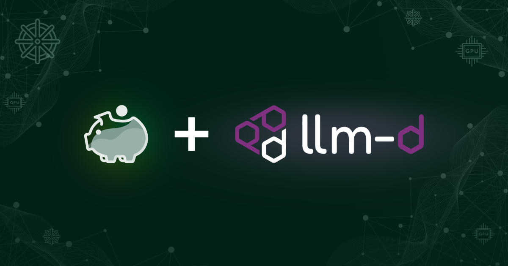

Your GPU bill is rising. Your models are serving billions of tokens. Yet one question remains unanswered: what does each token actually cost?

<!--truncate-->

This is not a hypothetical problem. Platform teams today operate in a fog regarding AI inference costs—they see infrastructure spend and track token throughput, but the connection between those numbers is invisible. Without per-model and per-token costs derived from actual resource consumption, every decision becomes a gamble.

- Is self-hosting cheaper than using a SaaS API? You're guessing.
- Which model is actually cost-efficient at your traffic levels? The data doesn't exist.
- Which team's agent workload is consuming your AI budget? Nobody knows.

The result is a large monthly bill with no clear explanation, while executives ask hard questions about AI return on investment (ROI) that you cannot answer with numbers.

> **Cost ≠ Price:** SaaS providers may price below cost to gain market share or well above cost for premium models. When comparing self-hosting costs to SaaS, keep this distinction in mind. An enterprise's cost for SaaS inference is the provider's price.

To close this gap, we are integrating [OpenCost](https://opencost.io), a CNCF incubating project, with [llm-d](https://llm-d.ai), a CNCF sandbox project for distributed LLM inference on Kubernetes. This post explains how the integration works, what metrics it produces, and how platform teams can use them to make data-driven decisions.

## GPUs are just CPUs with a bigger price tag and a worse visibility story

OpenCost's existing Kubernetes cost allocation logic already handles CPU, RAM, and general GPU costs. What was missing was the inference layer: the ability to connect infrastructure costs to the token stream flowing through vLLM and expose those costs in terms that are meaningful for AI platform decisions.

Kubernetes resource allocation has always had an efficiency problem. Teams size CPU and memory requests based on estimates, which often leads to overprovisioned workloads and silently accumulating idle capacity. With GPUs, the cost of getting this wrong is an order of magnitude higher. Measurement tooling hasn't kept up, making it difficult to measure efficiency or ROI.

A GPU actively serving a loaded LLM is expensive. A GPU sitting idle with a model loaded but no requests arriving is equally expensive, because the model's weights occupy VRAM whether or not inference is happening. For example, a low-traffic model might spend 95% of its time in this "warm but idle" state, burning through your budget while contributing zero productive tokens.

## Two costs, two questions

The core insight behind this integration is that there are two fundamentally different questions a platform team needs to answer, and they require different cost metrics.

**Allocation-based cost per model** include all costs attributed to running that model: GPU memory reserved for its weights, compute consumed during active inference, and a share of common infrastructure components such as gateway and KV cache storage. This is the cost of having the model available. It reconciles with your infrastructure bill and answers the question, "What is this model costing us?"

**Usage-based cost per model** includes only GPU and other infrastructure costs consumed during active inference. It attributes costs to the tokens actually processed and accounts for savings from KV cache hits. This answers the question, "What did this model's actual work cost?" The gap between the two figures represents the cost of keeping the model warm and ready. Depending on the workload, that gap may reflect a deliberate latency tradeoff, an opportunity to improve utilization, or both.

Both metrics can also be expressed as cost per million tokens, but they answer different questions and should never be confused.

Usage-based cost per million tokens is stable regardless of how busy the model is. It reflects the compute cost of active inference and is useful for comparing models and hardware configurations or for benchmarking active-inference costs against external API prices.

Allocation-based cost per million tokens varies with utilization. A model serving light traffic will have a higher allocation-based cost per token because fixed hosting costs—GPU reservation, model loading, and infrastructure components—are spread across fewer tokens. This is the relevant metric for build-vs-buy decisions.

The relationship between the two directly expresses GPU utilization without needing a separate metric:

```
Utilization = usage-based cost per million tokens / allocation-based cost per million tokens

Example:
  Usage-based:       $1.00 / million tokens  (compute only)
  Allocation-based:  $4.00 / million tokens  (full hosting cost)
  Utilization:       25%
```

## The build-vs-buy trap

A common cost-modeling mistake in AI infrastructure is using usage-based cost to justify self-hosting.

If your model's usage-based cost is $1.00 per million tokens and the SaaS API charges $2.00, self-hosted appears cheaper. But usage-based cost captures only active compute; it excludes GPU reservation, idle time, and infrastructure overhead. At 25% utilization, the actual self-hosting cost is $4.00 per million tokens, not $1.00.

The correct comparison is **allocation-based cost vs. external API price**:

```
Self-hosted model at 25% utilization:
  Usage-based cost per million tokens:      $1.00  (compute only — misleading)
  Allocation-based cost per million tokens: $4.00  (real cost — use this)
  External API price per million tokens:    $2.00

Conclusion: The external API is cheaper at the current utilization.
Self-hosting becomes competitive above ~50% utilization.
```

This framing also gives you an optimization target: increasing utilization through smarter routing, model sharing, or traffic consolidation reduces the allocation-based cost per token and can make self-hosting economical.

## What this integration actually measures

The integration uses metrics already present in an llm-d deployment: token throughput from vLLM (`vllm:prompt_tokens_total`, `vllm:generation_tokens_total`), GPU costs from OpenCost's existing allocation engine, and processing-time metrics that support separate cost calculations for input and output tokens.

The result is a new set of inference cost metrics published to Prometheus and available via OpenCost's REST API and MCP server:

| Metric | What it measures |
|---|---|
| `llm_total_hourly_cost` | Hourly cost per model |
| `llm_cost_per_million_tokens` | Blended cost per million tokens. Includes labels breaking out input and output costs per million tokens |

All metrics include labels for `model_name`, `model_version`, `namespace`, `cost_basis` (usage vs. allocation), and `workload_type` (currently always "inference").

Input and output token costs (including reasoning tokens) are reported separately because they reflect different compute workloads. Input tokens trigger the prefill phase, while output tokens drive the decode phase. In disaggregated serving deployments—where prefill and decode run on separate hardware—this distinction is essential for accurate cost attribution. The per-token metrics also account for the effect of KV cache hits on input-token processing costs.

## Beyond the GPU: the full cost of a running model

A model deployed on llm-d doesn't run in isolation. A complete cost picture must include the llm-d infrastructure components that surround it:

- **Inference Scheduler (EPP):** This gateway-level routing component is scoped to each InferencePool. It is CPU-only but still represents a real operational cost in high-throughput deployments.
- **llm-d gateway proxy:** This component sets up the gateway and may include a proxy pod. It is also scopred to each InferencePool.
- **KV cache storage:** In tiered-cache deployments, this can reach 18 TB of persistent storage. The integration treats it as an allocation cost because KV cache capacity is sized at deployment time rather than in proportion to request volume.
- **Workload Variant Autoscaler:** This cluster-wide component watches all InferencePools unless it is scoped to a namespace. Its cost is distributed across models using OpenCost's SharedLabels mechanism.

The SharedLabels approach keeps llm-d and OpenCost decoupled: llm-d components are labeled at deployment time, and OpenCost's shared-cost distribution logic handles attribution without requiring OpenCost to understand llm-d's internal architecture. These shared costs are included in allocation-based costs but excluded from usage-based costs.

## What good looks like: reading the cost matrix

The four combinations of allocation-based and usage-based costs each tell a distinct story:

| Allocation cost | Usage cost per million tokens | Diagnosis |
|---|---|---|
| High | Low | Costly to keep available but efficient during inference—utilization is the problem. Consider model sharing or traffic consolidation. |
| High | High | Expensive to host and expensive to run. Evaluate whether this model is the right choice for the workload. |
| Low | Low | Likely a well-sized deployment. The model fits its traffic profile. |
| Low | High | Cheap to host, but inference itself is costly. Evaluate model size, quantization, and hardware fit. |

A finance team running a chargeback program can query costs by namespace and team label to generate showback reports for billing periods. A FinOps team can identify underutilized models and quantify the savings from right-sizing or decommissioning. A smart router—which llm-d is developing—can use the REST API to factor per-token cost into routing decisions alongside latency and throughput.

## Where things stand

A proof-of-concept was implemented and tested on a cluster with 109 GPUs and 30 deployed AI models, and the generated metrics were validated.

AI inference costs metrics and APIs have been added to OpenCost, including support for measuring KV cache hits. A guide for deploying OpenCost with llm-d has also been created.

On the OpenCost side, work continues on measuring wasted GPU capacity, improving idle-GPU detection for LLM-specific patterns, integrating with the OpenCost UI, attributing costs to workloads and teams, and estimating optimization savings.

On the llm-d side, work is in progress on capturing workload and tenant metrics and on deployment with OpenCost.

Both projects are open source and contributions are welcome!

## More Updates Soon

Stay tuned for more updates as the integration progresses.
